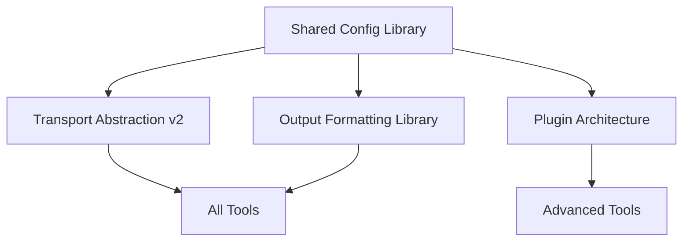

# MCP Command Tools Implementation Timeline & Dependencies

## Overview

This document provides a detailed implementation timeline and dependency analysis for the 18 new MCP command-line tools outlined in the COMMAND_ROADMAP.md. The timeline is designed to maximize parallel development while respecting critical dependencies and ensuring a logical progression of capabilities.

---

# Dependency Analysis

## Foundation Dependencies

### Core Infrastructure Requirements
These must be completed before any new tools can be developed:



### Critical Path Analysis

**Tier 1: Foundation (Prerequisites for everything)**
- Shared configuration management system
- Enhanced transport abstraction layer
- Unified output formatting library
- Common error handling framework

**Tier 2: Core Tools (Enable basic functionality)**
- `mcp-validate` (protocol validation foundation)
- `mcp-health` (production readiness foundation)  
- `mcp-bench` (performance measurement foundation)

**Tier 3: Ecosystem Tools (Build on core tools)**
- `mcp-gen` (depends on mcp-validate for schema validation)
- `mcp-security` (depends on mcp-validate and mcp-bench)
- `mcp-repl` (depends on mcp-validate and mcp-health)

**Tier 4: Advanced Tools (Integrate multiple foundations)**
- `mcp-studio` (depends on mcp-repl, mcp-validate, mcp-bench)
- `mcp-deploy` (depends on mcp-health, mcp-config, mcp-security)

---

# Detailed Implementation Timeline

## Q1 2025: Foundation & Critical Infrastructure

### Month 1: Foundation Development
**Weeks 1-2: Core Infrastructure**
```
Week 1-2: Shared Libraries Development
├── Unified Configuration System
│   ├── YAML/JSON config parsing
│   ├── Environment variable overrides
│   ├── Validation and schema support
│   └── Cross-tool compatibility layer
├── Enhanced Transport Abstraction v2
│   ├── Plugin-based transport system
│   ├── Connection pooling and health checking
│   ├── Async/streaming support improvements
│   └── Transport-specific middleware hooks
└── Output Formatting Library
    ├── JSON, YAML, Table, CSV formatters
    ├── Color and styling support
    ├── Streaming output capabilities
    └── Progress indicators and status displays
```

**Estimated Effort**: 3 developers × 2 weeks = 6 dev-weeks

### Month 2: Core Tool Development (Parallel Track 1)
**Weeks 3-6: Priority 1 Tools**

```
Week 3-4: mcp-validate Development
├── JSON Schema validation engine
├── Protocol compliance checker
├── Capability verification system
├── Batch processing support
├── Integration with existing test framework
└── Comprehensive error reporting

Week 3-4: mcp-health Development (Parallel)
├── Health check protocols
├── Service discovery integration
├── Kubernetes operator support
├── Alerting and notification system
├── Load balancer integration
└── Cluster management capabilities

Week 5-6: mcp-bench Development
├── Load testing framework
├── Stress testing capabilities
├── Latency measurement and analysis
├── Resource monitoring integration
├── Comparative benchmarking
└── Report generation and visualization
```

**Estimated Effort**: 3 developers × 4 weeks = 12 dev-weeks

### Month 3: Developer Experience Foundation
**Weeks 7-10: Priority 1 Developer Tools**

```
Week 7-8: mcp-repl Development
├── Interactive command interface
├── Auto-completion system
├── Session management
├── Multi-server support
├── Script execution engine
└── History and persistence

Week 9-10: mcp-gen Foundation
├── Template engine development
├── Go code analysis and generation
├── JSON schema to code generation
├── Multi-language support framework
├── Plugin architecture for languages
└── Integration with validation tools
```

**Estimated Effort**: 2 developers × 4 weeks = 8 dev-weeks

### Q1 Results: 
- **5 critical tools delivered**
- **Foundation for all future development**
- **26 dev-weeks total effort**

---

## Q2 2025: Production Readiness & Security

### Month 4: Security & Configuration
**Weeks 11-14: Security Foundation**

```
Week 11-12: mcp-security Development
├── Vulnerability scanning engine
├── Authentication testing framework
├── Authorization analysis tools
├── Input validation fuzzing
├── Compliance reporting system
└── Integration with CI/CD pipelines

Week 13-14: mcp-config Development
├── Environment-specific configuration
├── Secret management integration
├── Configuration validation
├── Template system
├── Hot reloading capabilities
└── Multi-environment promotion
```

**Estimated Effort**: 2 developers × 4 weeks = 8 dev-weeks

### Month 5: Code Generation & Scaffolding
**Weeks 15-18: Development Acceleration**

```
Week 15-16: mcp-scaffold Development
├── Project template system
├── Best practices integration
├── CI/CD configuration generation
├── Multi-language project support
├── Dependency management setup
└── Documentation generation

Week 17-18: mcp-gen Language Extensions
├── TypeScript/JavaScript generation
├── Python client/server generation
├── Rust implementation support
├── Java/Kotlin support
├── Documentation generation
└── Test suite generation
```

**Estimated Effort**: 2 developers × 4 weeks = 8 dev-weeks

### Month 6: Audit & Contract Testing
**Weeks 19-22: API Stability & Compliance**

```
Week 19-20: mcp-audit Development
├── Comprehensive audit logging
├── Log analysis and search
├── Anomaly detection system
├── Compliance reporting
├── Real-time monitoring
└── Data privacy compliance

Week 21-22: mcp-contract Development
├── Contract definition system
├── Consumer-driven testing
├── Compatibility matrix testing
├── Regression detection
├── API evolution tracking
└── Multi-version support
```

**Estimated Effort**: 2 developers × 4 weeks = 8 dev-weeks

### Q2 Results:
- **6 production-ready tools delivered**
- **Complete security and audit capabilities**
- **24 dev-weeks total effort**

---

## Q3 2025: Advanced Features & Optimization

### Month 7: Schema & Performance Analysis
**Weeks 23-26: Advanced Analysis Tools**

```
Week 23-24: mcp-schema Development
├── Schema generation from implementations
├── Schema comparison and analysis
├── Migration planning tools
├── Documentation generation
├── Version compatibility checking
└── Breaking change detection

Week 25-26: mcp-profile Development
├── Runtime performance analysis
├── CPU and memory profiling
├── I/O performance analysis
├── Blocking analysis
├── Call graph visualization
└── Optimization recommendations
```

**Estimated Effort**: 2 developers × 4 weeks = 8 dev-weeks

### Month 8: Deployment & Operations
**Weeks 27-30: Production Operations**

```
Week 27-28: mcp-deploy Development
├── Multi-platform deployment
├── Rolling update strategies
├── Rollback capabilities
├── Environment promotion
├── Integration testing
└── Blue-green deployments

Week 29-30: mcp-studio Foundation
├── Web-based interface framework
├── Real-time communication layer
├── Visual component system
├── Project management backend
├── Authentication and authorization
└── Plugin system architecture
```

**Estimated Effort**: 3 developers × 4 weeks = 12 dev-weeks

### Month 9: Documentation & Studio Development
**Weeks 31-34: Developer Experience Enhancement**

```
Week 31-32: mcp-docs Development
├── API documentation generation
├── Interactive examples system
├── Multi-format output support
├── Version management
├── Integration guides
└── Automated publishing

Week 33-34: mcp-studio Core Features
├── Visual flow designer
├── Real-time testing interface
├── Debugging capabilities
├── Documentation integration
├── Collaboration features
└── Export functionality
```

**Estimated Effort**: 3 developers × 4 weeks = 12 dev-weeks

### Q3 Results:
- **6 advanced tools delivered**
- **Complete developer experience suite**
- **32 dev-weeks total effort**

---

## Q4 2025: Optimization & Specialized Tools

### Month 10: Performance Optimization
**Weeks 35-38: AI-Powered Tools**

```
Week 35-36: mcp-optimize Development
├── Automated bottleneck detection
├── Machine learning optimization
├── Configuration tuning system
├── Code analysis and suggestions
├── Performance prediction models
└── Continuous optimization

Week 37-38: Advanced Studio Features
├── AI-powered code suggestions
├── Advanced debugging features
├── Performance visualization
├── Collaborative editing
├── Version control integration
└── Deployment integration
```

**Estimated Effort**: 2 developers × 4 weeks = 8 dev-weeks

### Month 11: Migration & Crypto Tools
**Weeks 39-42: Specialized Utilities**

```
Week 39-40: mcp-migrate Development
├── Protocol version migration
├── Automated code transformation
├── Compatibility analysis
├── Interactive migration wizard
├── Rollback capabilities
└── Migration validation

Week 41-42: mcp-crypto Development
├── Key management system
├── Message encryption/decryption
├── Digital signature support
├── Certificate management
├── HSM integration
└── Compliance validation
```

**Estimated Effort**: 2 developers × 4 weeks = 8 dev-weeks

### Month 12: Integration & Polish
**Weeks 43-46: Final Integration**

```
Week 43-44: Integration Testing
├── End-to-end tool integration
├── Performance optimization
├── Documentation completion
├── Security review
├── Compatibility testing
└── Release preparation

Week 45-46: Production Readiness
├── Monitoring and alerting setup
├── Support documentation
├── Training materials
├── Migration guides
├── Release automation
└── Community feedback integration
```

**Estimated Effort**: 3 developers × 4 weeks = 12 dev-weeks

### Q4 Results:
- **4 specialized tools delivered**
- **Complete ecosystem integration**
- **28 dev-weeks total effort**

---

# Resource Requirements & Team Structure

## Development Team Structure

### Core Team (Minimum Required)
```
Technical Lead (1 FTE)
├── Architecture decisions and technical direction
├── Code review and quality assurance
├── Cross-tool integration oversight
└── Performance and security standards

Senior Go Developers (3 FTE)
├── Core tool implementation
├── Shared library development
├── Performance optimization
└── Testing and validation

Frontend Developer (1 FTE) - Q3/Q4
├── mcp-studio web interface
├── Interactive documentation
├── Visualization components
└── User experience design

DevOps Engineer (0.5 FTE)
├── CI/CD pipeline development
├── Release automation
├── Infrastructure setup
└── Deployment tooling
```

### Specialized Contributors (Part-time/Contract)
```
Security Specialist (0.25 FTE)
├── Security tool requirements
├── Vulnerability assessment
├── Compliance validation
└── Security architecture review

UX Designer (0.25 FTE) - Q2/Q3
├── CLI user experience design
├── Studio interface design
├── Documentation design
└── Usability testing

Technical Writer (0.5 FTE)
├── Documentation development
├── User guides and tutorials
├── API documentation
└── Migration guides
```

## Total Resource Requirements

### Development Effort Summary
- **Q1 2025**: 26 dev-weeks (5 tools)
- **Q2 2025**: 24 dev-weeks (6 tools)  
- **Q3 2025**: 32 dev-weeks (6 tools)
- **Q4 2025**: 28 dev-weeks (4 tools + integration)
- **Total**: 110 dev-weeks (21 tools + integration)

### Annual Resource Cost (Estimated)
```
Core Development Team: $1.2M - $1.8M
├── Technical Lead: $180K - $220K
├── Senior Developers (3): $450K - $600K
├── Frontend Developer: $120K - $160K
└── DevOps Engineer (0.5): $60K - $80K

Specialized Contributors: $200K - $300K
├── Security Specialist (0.25): $50K - $75K
├── UX Designer (0.25): $40K - $60K
└── Technical Writer (0.5): $60K - $80K

Infrastructure & Tools: $50K - $100K
├── Development infrastructure
├── CI/CD platforms
├── Testing environments
└── Documentation platforms

Total Annual Investment: $1.45M - $2.2M
```

---

# Risk Assessment & Mitigation

## High-Risk Dependencies

### Critical Path Risks
1. **Shared Library Development Delays**
   - **Risk**: Foundation delays affect all downstream tools
   - **Mitigation**: Parallel proof-of-concept development, incremental delivery
   - **Timeline Impact**: Could delay entire program by 4-8 weeks

2. **Team Scaling Challenges**
   - **Risk**: Unable to hire qualified Go developers quickly
   - **Mitigation**: Contractor relationships, gradual team scaling, knowledge sharing
   - **Timeline Impact**: Could extend timeline by 25-50%

3. **Integration Complexity**
   - **Risk**: Tools don't integrate well with existing ecosystem
   - **Mitigation**: Early integration testing, API stability focus, backwards compatibility
   - **Timeline Impact**: Could require 4-6 weeks additional integration work

### Technical Risks

1. **Performance Requirements**
   - **Risk**: Tools don't meet performance expectations
   - **Mitigation**: Early benchmarking, performance budgets, continuous monitoring
   - **Contingency**: 2-week performance optimization sprint per quarter

2. **Security & Compliance**
   - **Risk**: Security tools don't meet enterprise requirements
   - **Mitigation**: Early security review, compliance expert consultation, external audit
   - **Contingency**: 4-week security hardening phase

3. **User Adoption**
   - **Risk**: Tools don't meet developer needs
   - **Mitigation**: User research, early feedback loops, iterative development
   - **Contingency**: 2-week UX improvement cycles

---

# Success Metrics & Milestones

## Quarterly Milestones

### Q1 2025: Foundation Success
- [ ] 5 core tools delivered and functional
- [ ] Shared library adoption by existing tools
- [ ] 90%+ test coverage for new tools
- [ ] Integration with mcpscripttest framework
- [ ] Performance benchmarks established

### Q2 2025: Production Readiness
- [ ] Security scanning integrated in CI/CD
- [ ] Production deployment capabilities
- [ ] Enterprise-grade audit logging
- [ ] Multi-language code generation
- [ ] Contract-based testing framework

### Q3 2025: Developer Experience
- [ ] Interactive development environment (studio)
- [ ] Comprehensive documentation automation
- [ ] Advanced performance analysis
- [ ] Automated deployment pipelines
- [ ] Visual debugging capabilities

### Q4 2025: Ecosystem Maturity
- [ ] AI-powered optimization tools
- [ ] Migration assistance for version upgrades
- [ ] Cryptographic security features
- [ ] Complete tool integration
- [ ] Community adoption metrics

## Key Performance Indicators

### Developer Productivity
- **Setup Time**: <5 minutes for new MCP project (vs 30+ minutes currently)
- **Development Cycle**: 50% reduction in debug-test-deploy cycle time  
- **Code Generation**: 80% of boilerplate code automated
- **Testing**: 90% automated test coverage achievable

### Production Operations
- **Deployment Success**: 99.9% successful deployments with rollback capability
- **Security Compliance**: 100% automated security validation
- **Performance Monitoring**: Real-time performance insights for all deployments
- **Incident Response**: <5 minute mean time to detection for issues

### Ecosystem Growth
- **Adoption Rate**: 50% of MCP projects using new tools within 6 months
- **Language Support**: 5+ programming languages with full SDK support
- **Community Contribution**: 20+ community-contributed tool extensions
- **Documentation Quality**: 95%+ user satisfaction with documentation

---

# Conclusion

This implementation timeline represents an ambitious but achievable roadmap for dramatically expanding the MCP command-line ecosystem. The phased approach ensures:

1. **Strong Foundation**: Critical infrastructure completed first
2. **Incremental Value**: Useful tools delivered each quarter
3. **Risk Management**: Dependencies managed and risks mitigated
4. **Resource Efficiency**: Parallel development maximized where possible
5. **Quality Assurance**: Testing and integration maintained throughout

The total investment of approximately $1.5-2.2M over 12 months will deliver 18+ new tools that transform the MCP development experience from a niche protocol implementation into a comprehensive, enterprise-ready development platform.

**Success depends on**: Strong technical leadership, early user feedback, disciplined execution of the timeline, and maintaining quality standards throughout rapid development.

The result will be a best-in-class command-line ecosystem that positions MCP as the leading protocol for AI-human collaboration, with tools that rival or exceed those available for established protocols like gRPC, GraphQL, and REST APIs.