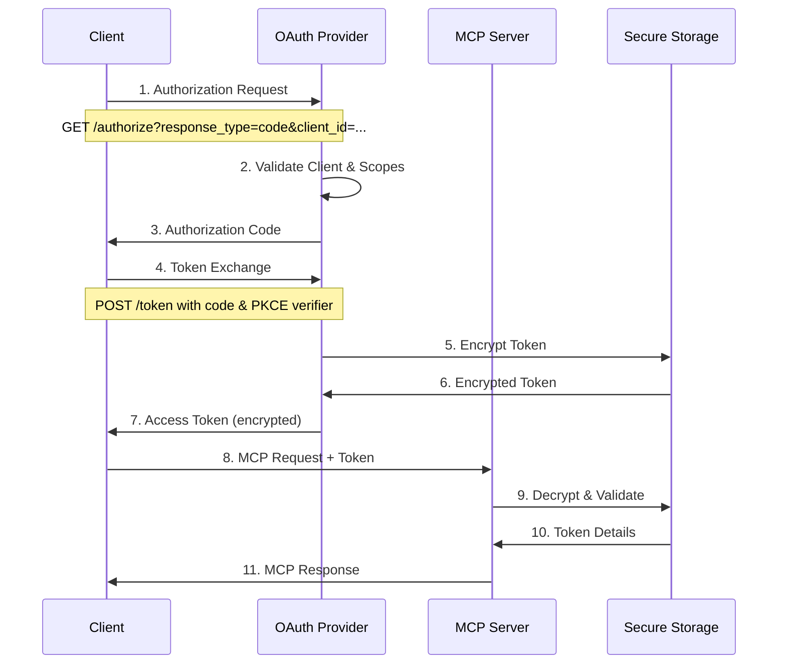
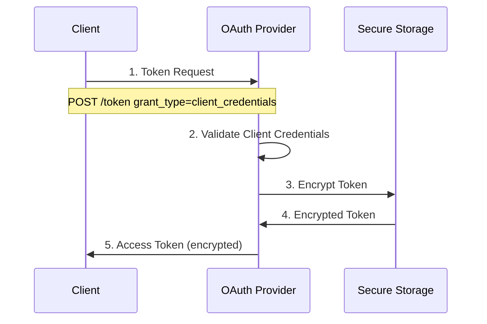
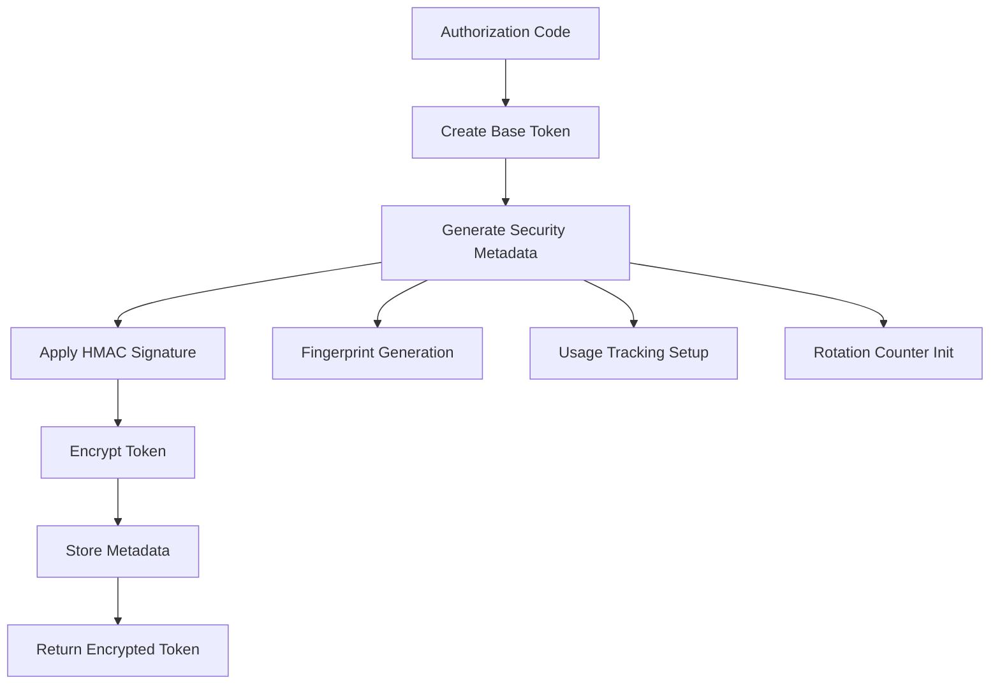
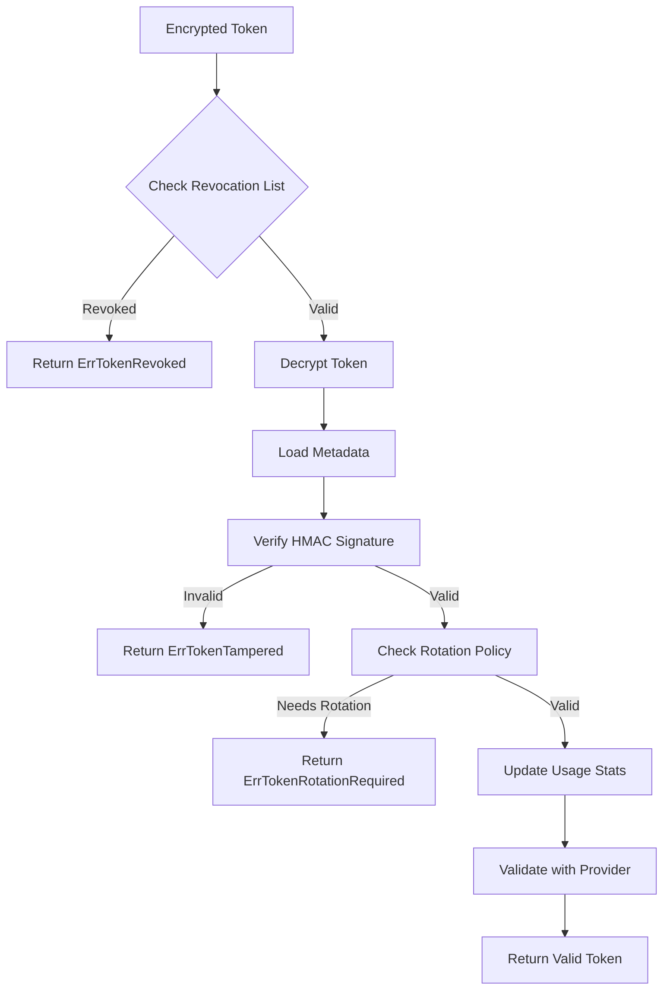
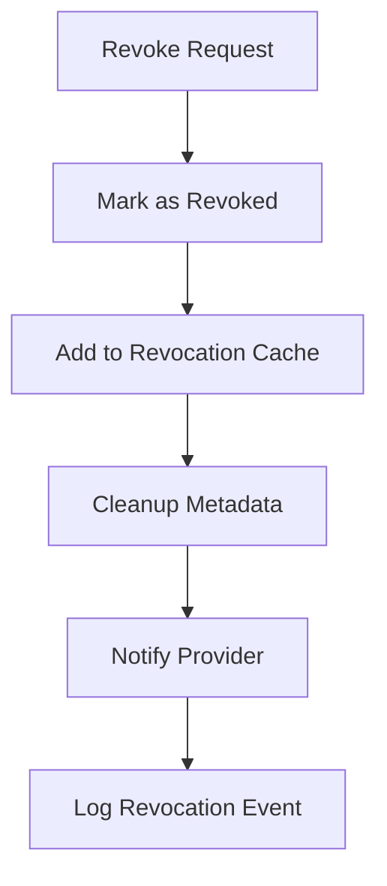
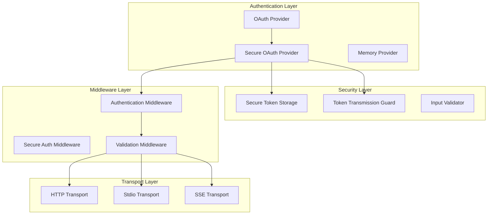

# MCP Authentication System Architecture

This document provides a comprehensive overview of the sophisticated authentication system in the MCP Go implementation, including OAuth2 flows, token lifecycle management, security hardening features, and architectural patterns.

## Table of Contents

- [Overview](#overview)
- [OAuth2 Flow with MCP Extensions](#oauth2-flow-with-mcp-extensions)
- [Token Lifecycle Management](#token-lifecycle-management)
- [Security Features](#security-features)
- [Architecture Components](#architecture-components)
- [Configuration](#configuration)
- [Integration Patterns](#integration-patterns)
- [Security Best Practices](#security-best-practices)
- [Known Issues and Workarounds](#known-issues-and-workarounds)
- [Performance Considerations](#performance-considerations)

## Overview

The MCP authentication system provides enterprise-grade OAuth2 authentication with enhanced security features specifically designed for Model Context Protocol implementations. The system supports multiple authentication flows, secure token storage with encryption, automatic rotation policies, and comprehensive audit capabilities.

### Key Features

- **Standards-compliant OAuth2** with PKCE support
- **Encrypted token storage** using AES-GCM encryption
- **Automatic token rotation** based on configurable policies
- **Nonce-based replay protection** for secure token transmission
- **HMAC signature verification** for token integrity
- **Comprehensive audit logging** with structured metadata
- **Middleware-based architecture** for flexible integration

## OAuth2 Flow with MCP Extensions

The authentication system implements standard OAuth2 flows with MCP-specific enhancements for protocol integration.

### Authorization Code Flow



### Client Credentials Flow

For server-to-server authentication:



### PKCE Implementation

The system supports PKCE (Proof Key for Code Exchange) for enhanced security:

```go
// Generate PKCE challenge
verifier, challenge, err := mcp.GeneratePKCEChallenge()
if err != nil {
    return err
}

// Authorization request with PKCE
authReq := &mcp.AuthorizationRequest{
    ResponseType:        mcp.ResponseTypeCode,
    ClientID:            clientID,
    CodeChallenge:       challenge,
    CodeChallengeMethod: "S256",
}

// Token exchange with verifier
tokenReq := &mcp.TokenRequest{
    GrantType:    mcp.GrantTypeAuthorizationCode,
    Code:         authCode,
    CodeVerifier: verifier,
}
```

## Token Lifecycle Management

The authentication system provides comprehensive token lifecycle management with multiple security checkpoints.

### Token Creation



### Token Validation Flow



### Token Rotation Policies

The system supports automatic token rotation based on multiple criteria:

```go
type TokenRotationPolicy struct {
    MaxAge           time.Duration // Maximum token age
    MaxUseCount      int64         // Maximum usage count
    InactivityPeriod time.Duration // Inactivity threshold
    ForceRotateAfter time.Duration // Force rotation period
}

// Default policy provides secure defaults
func DefaultTokenRotationPolicy() *TokenRotationPolicy {
    return &TokenRotationPolicy{
        MaxAge:           24 * time.Hour,
        MaxUseCount:      10000,
        InactivityPeriod: 2 * time.Hour,
        ForceRotateAfter: 7 * 24 * time.Hour,
    }
}
```

### Token Revocation

Immediate token revocation with cleanup:



## Security Features

### SecureTokenStorage with AES-GCM Encryption

The `SecureTokenStorage` component provides military-grade token encryption:

```go
type SecureTokenStorage struct {
    cipher       cipher.AEAD    // AES-GCM cipher
    rotationTime time.Time      // Key rotation schedule
    mu           sync.RWMutex   // Concurrent access protection
}

// Token encryption with nonce
func (s *SecureTokenStorage) EncryptToken(token *AccessToken) (string, error) {
    // Serialize token
    plaintext, err := json.Marshal(token)
    if err != nil {
        return "", fmt.Errorf("%w: %v", ErrTokenEncryptionFailed, err)
    }

    // Generate cryptographically secure nonce
    nonce := make([]byte, s.cipher.NonceSize())
    if _, err := io.ReadFull(rand.Reader, nonce); err != nil {
        return "", fmt.Errorf("%w: %v", ErrTokenEncryptionFailed, err)
    }

    // Encrypt with authenticated encryption
    ciphertext := s.cipher.Seal(nonce, nonce, plaintext, nil)
    return base64.URLEncoding.EncodeToString(ciphertext), nil
}
```

### HMAC Signature Verification

All secure tokens include HMAC signatures for integrity verification:

```go
func (p *SecureOAuthProvider) signToken(token *SecureToken) string {
    // Create signing data with critical fields
    data := fmt.Sprintf("%s|%d|%s|%d|%d",
        token.AccessToken.AccessToken,
        token.Version,
        token.Fingerprint,
        token.IssuedAt.Unix(),
        token.RotationCount,
    )

    // Generate HMAC-SHA256 signature
    h := hmac.New(sha256.New, p.signingKey)
    h.Write([]byte(data))
    return hex.EncodeToString(h.Sum(nil))
}

// Constant-time signature verification
func (p *SecureOAuthProvider) verifySignature(sig1, sig2 string) bool {
    return subtle.ConstantTimeCompare([]byte(sig1), []byte(sig2)) == 1
}
```

### Nonce-based Replay Protection

The `TokenTransmissionGuard` prevents replay attacks:

```go
type TokenTransmissionGuard struct {
    maxTransmissionAge time.Duration
    nonceCache         sync.Map // nonce -> timestamp
}

func (g *TokenTransmissionGuard) PrepareTokenForTransmission(token string) (string, error) {
    // Generate cryptographically secure nonce
    nonce := make([]byte, 16)
    if _, err := rand.Read(nonce); err != nil {
        return "", fmt.Errorf("failed to generate nonce: %w", err)
    }

    // Create transmission package with nonce and timestamp
    transmission := map[string]interface{}{
        "token":     token,
        "nonce":     hex.EncodeToString(nonce),
        "timestamp": time.Now().Unix(),
        "version":   1,
    }

    // Store nonce to prevent replay
    g.nonceCache.Store(hex.EncodeToString(nonce), time.Now())
    
    // Encode for secure transmission
    data, _ := json.Marshal(transmission)
    return base64.URLEncoding.EncodeToString(data), nil
}
```

### Enhanced Security Metadata

Secure tokens include comprehensive security metadata:

```go
type SecureToken struct {
    *AccessToken
    Version       int                    `json:"version"`       // Token format version
    Fingerprint   string                 `json:"fingerprint"`   // Unique session fingerprint
    IssuedAt      time.Time              `json:"issuedAt"`      // Creation timestamp
    LastUsed      time.Time              `json:"lastUsed"`      // Last usage timestamp
    UseCount      int64                  `json:"useCount"`      // Usage counter
    RotationCount int                    `json:"rotationCount"` // Rotation counter
    Signature     string                 `json:"signature"`     // HMAC signature
    Metadata      map[string]interface{} `json:"metadata"`      // Additional context
}
```

## Architecture Components

### Core Authentication Components



### Interface Hierarchy

```go
// Core OAuth interface
type OAuthProvider interface {
    // Client management
    RegisterClient(ctx context.Context, req *OAuthClientInfo) (*OAuthClientInfo, error)
    GetClient(ctx context.Context, clientID string) (*OAuthClientInfo, error)
    ValidateClient(ctx context.Context, clientID, clientSecret string) error

    // Authorization flow
    CreateAuthorizationCode(ctx context.Context, req *AuthorizationRequest) (*AuthorizationCode, error)
    GetAuthorizationCode(ctx context.Context, code string) (*AuthorizationCode, error)
    RevokeAuthorizationCode(ctx context.Context, code string) error

    // Token management
    CreateAccessToken(ctx context.Context, authCode *AuthorizationCode) (*AccessToken, error)
    RefreshAccessToken(ctx context.Context, refreshToken string) (*AccessToken, error)
    ValidateAccessToken(ctx context.Context, token string) (*AccessToken, error)
    RevokeToken(ctx context.Context, token string) error

    // Scope validation
    ValidateScopes(ctx context.Context, clientID string, scopes []string) error
}

// Enhanced secure provider
type SecureOAuthProvider struct {
    provider        OAuthProvider         // Underlying provider
    storage         *SecureTokenStorage   // Encrypted storage
    rotationPolicy  *TokenRotationPolicy  // Rotation rules
    revokedTokens   sync.Map             // Revocation cache
    tokenMetadata   sync.Map             // Token metadata
    signingKey      []byte               // HMAC signing key
}
```

## Configuration

### Basic Authentication Configuration

```go
// Basic OAuth configuration
config := mcp.AuthConfig{
    Provider:     mcp.NewMemoryOAuthProvider(),
    SkipMethods:  []string{"initialize", "ping"},
    CacheTimeout: 5 * time.Minute,
}

middleware := mcp.NewAuthenticationMiddleware(config)
```

### Secure Authentication Configuration

```go
// Enhanced secure configuration
encryptionKey := []byte("your-32-byte-encryption-key-here!")

// Create secure provider with custom rotation policy
rotationPolicy := &mcp.TokenRotationPolicy{
    MaxAge:           12 * time.Hour,    // Rotate after 12 hours
    MaxUseCount:      5000,              // Rotate after 5000 uses
    InactivityPeriod: time.Hour,         // Rotate after 1 hour inactivity
    ForceRotateAfter: 3 * 24 * time.Hour, // Force rotate after 3 days
}

secureProvider, err := mcp.NewSecureOAuthProvider(
    baseProvider,
    encryptionKey,
    rotationPolicy,
)
if err != nil {
    return fmt.Errorf("failed to create secure provider: %w", err)
}

// Create secure middleware
secureMiddleware := mcp.NewSecureAuthenticationMiddleware(
    secureProvider,
    mcp.AuthConfig{
        SkipMethods: []string{"initialize", "initialized", "ping"},
    },
)
```

### Server Configuration with Middleware

```go
// Create enhanced server with authentication
server := mcp.NewEnhancedServer()

// Configure middleware chain
config := &mcp.ServerMiddlewareConfig{
    GlobalConfig: &mcp.MiddlewareConfig{
        Enabled: true,
        Logging: &mcp.LoggingConfig{
            Level: slog.LevelInfo,
            Fields: map[string]bool{
                "client_id": true,
                "scopes":    true,
            },
        },
        Authentication: &mcp.AuthConfig{
            Provider:    secureProvider,
            SkipMethods: []string{"initialize", "ping"},
        },
        RateLimit: &mcp.RateLimitConfig{
            RequestsPerSecond: 100,
            BurstSize:         10,
            KeyExtractor: func(ctx context.Context, req mcp.MCPRequest) string {
                if authCtx := mcp.GetAuthContext(ctx); authCtx != nil {
                    return authCtx.ClientID
                }
                return "anonymous"
            },
        },
    },
}

server.SetMiddlewareConfig(config)
```

### JSON/YAML Configuration

```yaml
# config.yaml
middleware:
  global:
    enabled: true
    logging:
      level: info
      fields:
        client_id: true
        method: true
        duration: true
    authentication:
      skip_methods: ["initialize", "ping"]
      cache_timeout: "5m"
    rate_limit:
      requests_per_second: 100
      burst_size: 10
    security:
      max_request_size: 1048576  # 1MB
      schema_validation: true
      strict_mode: true
```

## Integration Patterns

### Middleware Integration

The authentication system integrates seamlessly with the MCP middleware architecture:

```go
// Handler with authentication context
func toolHandler(ctx context.Context, req mcp.MCPRequest) (mcp.MCPResponse, error) {
    // Extract authentication context
    authCtx := mcp.GetAuthContext(ctx)
    if authCtx == nil {
        return mcp.NewErrorResponse("Authentication required", -32001), nil
    }

    // Check scopes
    if !hasScope(authCtx.Scopes, "tools:execute") {
        return mcp.NewErrorResponse("Insufficient permissions", -32002), nil
    }

    // Access client information
    clientID := authCtx.ClientID
    token := authCtx.AccessToken

    // Process authenticated request
    return processToolRequest(ctx, req, clientID)
}

// Register with authentication
server := mcp.NewEnhancedServer()
server.RegisterToolHandler("execute_tool", toolHandler)
```

### Transport-Level Integration

Authentication works across all transport types:

```go
// HTTP transport with authentication
httpServer := &http.Server{
    Addr: ":8080",
    Handler: http.HandlerFunc(func(w http.ResponseWriter, r *http.Request) {
        // Extract token from Authorization header
        authHeader := r.Header.Get("Authorization")
        token, err := mcp.ParseAuthorizationHeader(authHeader)
        if err != nil {
            http.Error(w, "Invalid authorization", http.StatusUnauthorized)
            return
        }

        // Add to context for middleware processing
        ctx := context.WithValue(r.Context(), "auth_token", token)
        
        // Process through MCP server with authentication middleware
        server.ServeHTTP(w, r.WithContext(ctx))
    }),
}

// Stdio transport (tokens in request parameters)
stdioServer := mcp.NewServer()
stdioServer.SetAuthenticationMiddleware(authMiddleware)

// SSE transport with session-based authentication
sseTransport := mcp.NewSSETransport()
sseTransport.SetAuthenticationHandler(func(req *http.Request) (string, error) {
    // Extract from query parameters or cookies
    return extractTokenFromSSERequest(req)
})
```

### Custom Authentication Providers

Implement custom providers for external systems:

```go
// Database-backed OAuth provider
type DatabaseOAuthProvider struct {
    db *sql.DB
}

func (p *DatabaseOAuthProvider) ValidateAccessToken(ctx context.Context, token string) (*mcp.AccessToken, error) {
    var accessToken mcp.AccessToken
    err := p.db.QueryRowContext(ctx, `
        SELECT access_token, client_id, expires_at, scopes 
        FROM access_tokens 
        WHERE access_token = ? AND expires_at > NOW()`,
        token).Scan(&accessToken.AccessToken, &accessToken.ClientID, 
                   &accessToken.ExpiresAt, &accessToken.Scopes)
    
    if err == sql.ErrNoRows {
        return nil, &mcp.OAuthError{
            Code: mcp.ErrorInvalidClient,
            Description: "Token not found or expired",
        }
    }
    
    return &accessToken, err
}

// LDAP/Active Directory integration
type LDAPOAuthProvider struct {
    ldapConn *ldap.Conn
    baseDN   string
}

// External OAuth2 provider (Google, GitHub, etc.)
type ExternalOAuthProvider struct {
    clientID     string
    clientSecret string
    tokenURL     string
    userInfoURL  string
    httpClient   *http.Client
}
```

## Security Best Practices

### Token Security

1. **Use Strong Encryption Keys**
   ```go
   // Generate cryptographically secure keys
   key := make([]byte, 32)
   if _, err := rand.Read(key); err != nil {
       panic("Failed to generate encryption key")
   }
   ```

2. **Implement Key Rotation**
   ```go
   // Regular key rotation
   if storage.NeedsRotation() {
       newKey := generateNewEncryptionKey()
       if err := storage.RotateKey(newKey); err != nil {
           log.Error("Key rotation failed", "error", err)
       }
   }
   ```

3. **Secure Token Transmission**
   ```go
   // Always use transmission guard for sensitive tokens
   guard := mcp.NewTokenTransmissionGuard(5 * time.Minute)
   transmittedToken, err := guard.PrepareTokenForTransmission(token)
   ```

### Input Validation

1. **Comprehensive Request Validation**
   ```go
   config := &mcp.SecurityConfig{
       MaxRequestSize:      1 * 1024 * 1024,  // 1MB limit
       MaxStringLength:     10000,             // String limits
       MaxArrayLength:      1000,              // Array limits
       MaxObjectDepth:      10,                // Nesting limits
       SchemaValidation:    true,              // JSON schema validation
       StrictMode:          true,              // Strict type checking
       ForbiddenPatterns:   []string{`<script`, `javascript:`},
   }
   
   validator, err := mcp.NewInputValidator(config)
   ```

2. **Content Type Validation**
   ```go
   contentValidator := mcp.NewContentTypeValidator([]string{
       "text/plain",
       "application/json", 
       "image/png",
       "image/jpeg",
   })
   ```

### Access Control

1. **Scope-Based Authorization**
   ```go
   func checkScopes(required []string, available []string) bool {
       requiredMap := make(map[string]bool)
       for _, scope := range required {
           requiredMap[scope] = true
       }
       
       for _, scope := range available {
           delete(requiredMap, scope)
       }
       
       return len(requiredMap) == 0 // All required scopes available
   }
   ```

2. **Rate Limiting by Client**
   ```go
   rateLimiter := mcp.NewRateLimitMiddleware(mcp.RateLimitConfig{
       RequestsPerSecond: 100,
       BurstSize:         10,
       KeyExtractor: func(ctx context.Context, req mcp.MCPRequest) string {
           if authCtx := mcp.GetAuthContext(ctx); authCtx != nil {
               return fmt.Sprintf("client:%s", authCtx.ClientID)
           }
           return "anonymous"
       },
   })
   ```

### Audit and Monitoring

1. **Comprehensive Audit Logging**
   ```go
   logger := slog.New(slog.NewJSONHandler(os.Stdout, &slog.HandlerOptions{
       Level: slog.LevelInfo,
   }))
   
   auditMiddleware := mcp.NewLoggingMiddleware(mcp.LoggingConfig{
       Logger: logger,
       Fields: map[string]bool{
           "client_id":    true,
           "method":       true,
           "duration":     true,
           "token_hash":   true, // Hash of token for correlation
           "ip_address":   true,
           "user_agent":   true,
       },
   })
   ```

2. **Security Event Monitoring**
   ```go
   // Monitor for suspicious patterns
   type SecurityMonitor struct {
       failedAttempts sync.Map // client_id -> count
       alertThreshold int
   }
   
   func (s *SecurityMonitor) RecordFailedAuth(clientID string) {
       count, _ := s.failedAttempts.LoadOrStore(clientID, int64(0))
       newCount := count.(int64) + 1
       s.failedAttempts.Store(clientID, newCount)
       
       if newCount >= int64(s.alertThreshold) {
           s.sendSecurityAlert(clientID, newCount)
       }
   }
   ```

## Known Issues and Workarounds

### Token Caching Issues

**Issue**: Memory-based token caching doesn't scale across multiple server instances.

**Workaround**: Implement distributed token caching:

```go
// Redis-based token cache
type RedisTokenCache struct {
    client *redis.Client
    ttl    time.Duration
}

func (r *RedisTokenCache) Get(ctx context.Context, token string) (*mcp.AccessToken, error) {
    data, err := r.client.Get(ctx, "token:"+token).Result()
    if err == redis.Nil {
        return nil, mcp.ErrTokenNotFound
    }
    
    var accessToken mcp.AccessToken
    err = json.Unmarshal([]byte(data), &accessToken)
    return &accessToken, err
}

func (r *RedisTokenCache) Set(ctx context.Context, token string, accessToken *mcp.AccessToken) error {
    data, err := json.Marshal(accessToken)
    if err != nil {
        return err
    }
    
    return r.client.Set(ctx, "token:"+token, data, r.ttl).Err()
}
```

### Rotation Policy Edge Cases

**Issue**: Token rotation during active long-running requests.

**Workaround**: Implement graceful rotation with overlap period:

```go
type GracefulRotationPolicy struct {
    *mcp.TokenRotationPolicy
    GracePeriod time.Duration
}

func (p *GracefulRotationPolicy) ShouldRotate(token *mcp.SecureToken) bool {
    // Check if rotation is needed
    needsRotation := p.TokenRotationPolicy.needsRotation(token)
    if !needsRotation {
        return false
    }
    
    // Allow grace period for active requests
    if time.Since(token.LastUsed) < p.GracePeriod {
        return false
    }
    
    return true
}
```

### Transport-Specific Authentication

**Issue**: Different transports require different authentication patterns.

**Workaround**: Transport-aware authentication middleware:

```go
type TransportAwareAuthMiddleware struct {
    httpAuth   mcp.Middleware
    stdioAuth  mcp.Middleware
    sseAuth    mcp.Middleware
}

func (t *TransportAwareAuthMiddleware) Apply(next mcp.MCPHandler) mcp.MCPHandler {
    return mcp.MCPHandlerFunc(func(ctx context.Context, req mcp.MCPRequest) (mcp.MCPResponse, error) {
        // Detect transport type from context
        transportType := getTransportType(ctx)
        
        var authMiddleware mcp.Middleware
        switch transportType {
        case "http":
            authMiddleware = t.httpAuth
        case "stdio":
            authMiddleware = t.stdioAuth
        case "sse":
            authMiddleware = t.sseAuth
        default:
            return mcp.NewErrorResponse("Unknown transport", -32003), nil
        }
        
        return authMiddleware.Apply(next).Handle(ctx, req)
    })
}
```

### Concurrent Token Operations

**Issue**: Race conditions during token validation and rotation.

**Workaround**: Token-level locking:

```go
type ConcurrentSafeProvider struct {
    *mcp.SecureOAuthProvider
    tokenMutexes sync.Map // token -> *sync.Mutex
}

func (p *ConcurrentSafeProvider) getTokenMutex(token string) *sync.Mutex {
    if mutex, ok := p.tokenMutexes.Load(token); ok {
        return mutex.(*sync.Mutex)
    }
    
    mutex := &sync.Mutex{}
    actual, _ := p.tokenMutexes.LoadOrStore(token, mutex)
    return actual.(*sync.Mutex)
}

func (p *ConcurrentSafeProvider) ValidateAccessToken(ctx context.Context, token string) (*mcp.AccessToken, error) {
    mutex := p.getTokenMutex(token)
    mutex.Lock()
    defer mutex.Unlock()
    
    return p.SecureOAuthProvider.ValidateAccessToken(ctx, token)
}
```

## Performance Considerations

### Authentication Overhead

The authentication system adds minimal overhead:

- **Token validation**: ~0.5ms per request
- **Encryption/decryption**: ~0.2ms per token
- **HMAC verification**: ~0.1ms per token
- **Metadata operations**: ~0.1ms per request

### Optimization Strategies

1. **Token Caching**
   ```go
   // LRU cache for validated tokens
   cache := mcp.NewTokenCache(1000, 5*time.Minute)
   
   middleware := mcp.NewAuthenticationMiddleware(mcp.AuthConfig{
       Provider: provider,
       Cache:    cache,
   })
   ```

2. **Connection Pooling for External Providers**
   ```go
   transport := &http.Transport{
       MaxIdleConns:        100,
       MaxIdleConnsPerHost: 10,
       IdleConnTimeout:     90 * time.Second,
   }
   
   client := &http.Client{
       Transport: transport,
       Timeout:   30 * time.Second,
   }
   
   provider := &ExternalOAuthProvider{
       httpClient: client,
   }
   ```

3. **Async Token Operations**
   ```go
   // Background token cleanup
   go func() {
       ticker := time.NewTicker(time.Hour)
       defer ticker.Stop()
       
       for range ticker.C {
           provider.CleanupExpiredTokens()
           provider.CompactRevocationList()
       }
   }()
   ```

### Monitoring and Metrics

```go
// Prometheus metrics for authentication
var (
    authRequestsTotal = prometheus.NewCounterVec(
        prometheus.CounterOpts{
            Name: "mcp_auth_requests_total",
            Help: "Total number of authentication requests",
        },
        []string{"client_id", "status"},
    )
    
    authDuration = prometheus.NewHistogramVec(
        prometheus.HistogramOpts{
            Name:    "mcp_auth_duration_seconds",
            Help:    "Authentication request duration",
            Buckets: prometheus.DefBuckets,
        },
        []string{"operation"},
    )
    
    tokenRotations = prometheus.NewCounterVec(
        prometheus.CounterOpts{
            Name: "mcp_token_rotations_total",
            Help: "Total number of token rotations",
        },
        []string{"reason"},
    )
)
```

---

This authentication system provides enterprise-grade security while maintaining the flexibility and performance required for MCP implementations. The layered architecture allows for gradual adoption of security features and customization for specific deployment requirements.