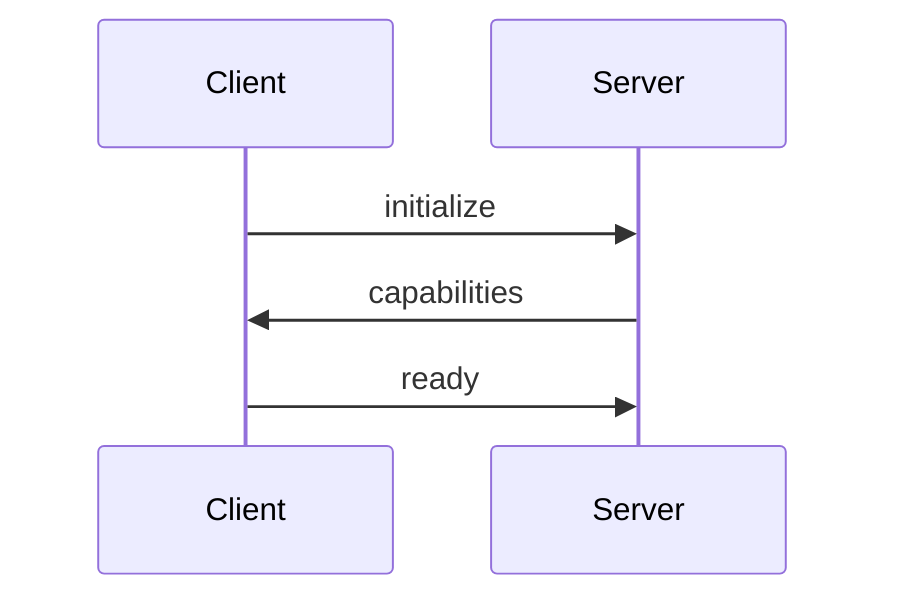
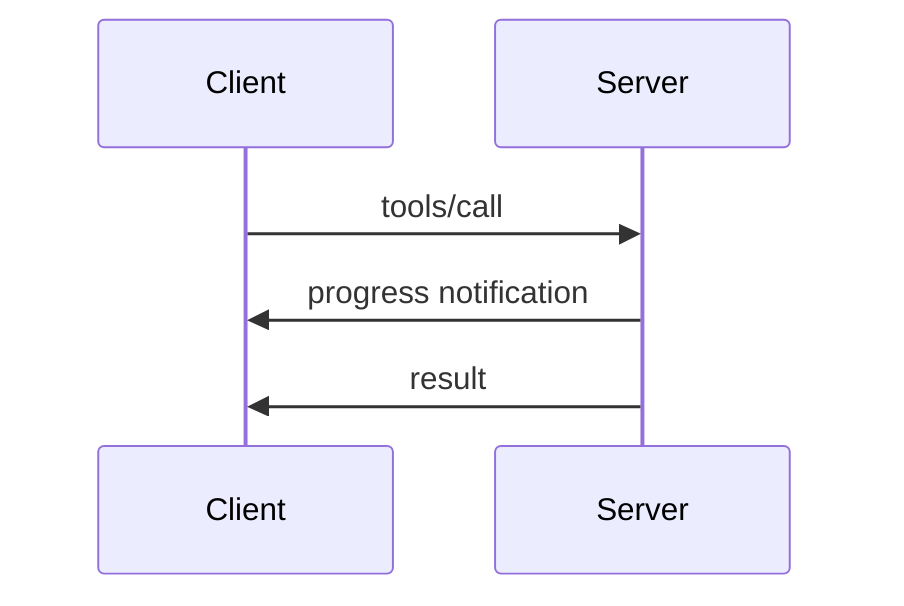
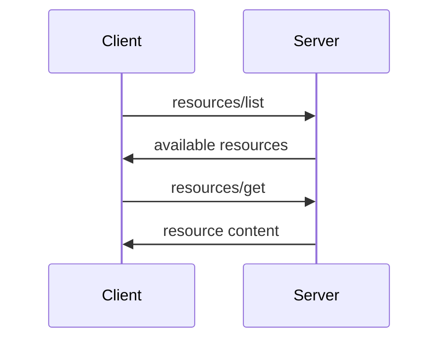

# Protocol Overview

The Model Context Protocol (MCP) is a standardized protocol that enables AI models to interact with external systems through a unified interface.

## Purpose

MCP provides a consistent way for AI models to:
- Access external tools and services
- Retrieve structured data resources  
- Present interactive prompts to users
- Maintain context across interactions

## Design Principles

### 1. Transport Agnostic

MCP is designed to work over multiple transport layers:
- Standard I/O for local processes
- HTTP/SSE for web services
- WebSockets for real-time communication
- Custom transports for specialized needs

### 2. JSON-RPC Based

All communication uses JSON-RPC 2.0 for:
- Consistent message format
- Request-response patterns
- Asynchronous notifications
- Standardized error handling

### 3. Capability Declaration

Servers explicitly declare their capabilities:
```json
{
  "tools": ["calculate", "search"],
  "resources": ["file:///data/*"],
  "prompts": ["confirm", "input"]
}
```

### 4. Stateless by Default

Each request is independent:
- No required session state
- Optional context preservation
- Scalable architecture

### 5. Type Safety

Strong typing throughout:
- JSON Schema validation
- Type-safe implementations
- Compile-time checks in Go

## Protocol Flow

### 1. Initialization



### 2. Tool Execution



### 3. Resource Access



## Message Types

### Requests

All requests follow JSON-RPC format:
```json
{
  "jsonrpc": "2.0",
  "id": "unique-id",
  "method": "method-name",
  "params": {
    // method-specific parameters
  }
}
```

### Responses

Successful responses:
```json
{
  "jsonrpc": "2.0",
  "id": "unique-id",
  "result": {
    // method-specific result
  }
}
```

Error responses:
```json
{
  "jsonrpc": "2.0",
  "id": "unique-id",
  "error": {
    "code": -32602,
    "message": "Invalid params",
    "data": {
      // optional error details
    }
  }
}
```

### Notifications

Notifications have no ID:
```json
{
  "jsonrpc": "2.0",
  "method": "notification-name",
  "params": {
    // notification data
  }
}
```

## Core Methods

### Lifecycle Methods

- `initialize` - Start session, exchange capabilities
- `shutdown` - Graceful shutdown
- `exit` - Immediate termination

### Tool Methods

- `tools/list` - List available tools
- `tools/call` - Execute a tool
- `tools/cancel` - Cancel execution

### Resource Methods

- `resources/list` - List available resources
- `resources/get` - Retrieve resource content
- `resources/search` - Search resources

### Prompt Methods

- `prompts/list` - List available prompts
- `prompts/show` - Display prompt to user
- `prompts/respond` - User's response

## Versioning

MCP uses semantic versioning:
- Major: Breaking changes
- Minor: New features, backward compatible
- Patch: Bug fixes

Current version: `1.0.0`

## Extensions

MCP supports extensions through:
- Custom methods
- Additional capabilities
- Transport-specific features
- Vendor-specific namespaces

## Security Considerations

### Authentication

- Transport-level authentication
- Method-level authorization
- Token-based access control

### Data Protection

- TLS for network transports
- Input validation
- Output sanitization

### Rate Limiting

- Request throttling
- Concurrent request limits
- Resource usage controls

## Best Practices

### For Clients

1. Always check server capabilities
2. Handle errors gracefully
3. Respect rate limits
4. Use appropriate timeouts

### For Servers

1. Declare capabilities accurately
2. Validate all inputs
3. Provide helpful error messages
4. Implement proper cleanup

## Conformance

Implementations should:
- Support required methods
- Follow JSON-RPC specification
- Implement at least one transport
- Pass conformance tests

## Next Steps

- Learn about [Transports](./transports.md)
- Understand [JSON-RPC Messages](./jsonrpc.md)
- Explore [Capabilities](./capabilities.md)

## References

- [JSON-RPC 2.0 Specification](https://www.jsonrpc.org/specification)
- [MCP Specification](https://github.com/modelcontextprotocol/specification)
- [Implementation Guide](../getting-started/README.md)