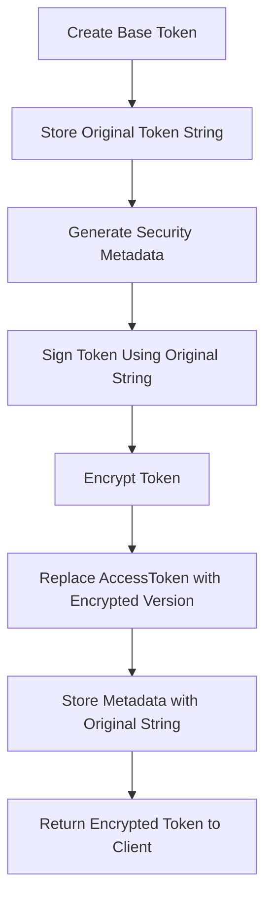
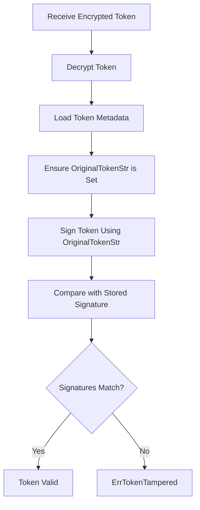

# Token Signature Verification Fix

## Overview

This document details the comprehensive fix applied to the MCP authentication system to resolve token signature verification failures that were occurring due to mutable token data during the encryption/decryption lifecycle.

## The Problem: Token Signature Verification Failing

### Root Cause

The original authentication system had a critical flaw in how token signatures were calculated and verified. The issue stemmed from using mutable token data for HMAC signature calculation, which led to signature mismatches during token validation.

#### Specific Issue Details

1. **Token Lifecycle Problem**: When a token was created, it went through this process:
   - Base token created with original access token string
   - Token was encrypted and the encrypted version replaced the original token string
   - HMAC signature was calculated using the encrypted token string
   - During validation, the token was decrypted, restoring the original token string
   - Signature verification failed because it was comparing signatures calculated with different token values

2. **Data Integrity Issue**: The core problem was that the same `AccessToken.AccessToken` field was being used for:
   - The actual token value returned to clients (encrypted)
   - The signing data for HMAC calculation
   - This dual-use caused signature calculation to be based on different values during creation vs. validation

3. **Signature Mismatch Flow**:
   ```
   Creation:     Original Token → Encrypt → Sign(Encrypted Token) → Store signature
   Validation:   Encrypted Token → Decrypt → Sign(Original Token) → Compare signatures
   Result:       Signatures don't match because signing data is different
   ```

### Error Manifestation

The issue manifested as:
- `ErrTokenTampered` errors during token validation
- Authentication failures for valid, untampered tokens
- Signature verification failures in debug logs
- Intermittent auth failures that appeared to be random

## The Solution: OriginalTokenStr Field

### Core Fix

The fix involved adding a new field `OriginalTokenStr` to the `SecureToken` struct to preserve the unencrypted token value specifically for signature calculation.

#### Key Changes Made

1. **SecureToken Structure Enhancement**:
   ```go
   type SecureToken struct {
       *AccessToken
       Version          int                    `json:"version"`
       Fingerprint      string                 `json:"fingerprint"`
       IssuedAt         time.Time              `json:"issuedAt"`
       LastUsed         time.Time              `json:"lastUsed"`
       UseCount         int64                  `json:"useCount"`
       RotationCount    int                    `json:"rotationCount"`
       Signature        string                 `json:"signature"`
       Metadata         map[string]interface{} `json:"metadata,omitempty"`
       // NEW FIELD: Store original unencrypted token for signature verification
       OriginalTokenStr string                 `json:"originalToken"`
   }
   ```

2. **Token Creation Process Update**:
   ```go
   // In CreateAccessToken - Store original token before encryption
   secureToken := &SecureToken{
       AccessToken:      baseToken,
       Version:          1,
       Fingerprint:      p.generateFingerprint(ctx),
       IssuedAt:         now,
       LastUsed:         now,
       UseCount:         0,
       RotationCount:    0,
       OriginalTokenStr: baseToken.AccessToken, // Store the original unencrypted token
       Metadata: map[string]interface{}{
           "clientInfo": p.extractClientInfo(ctx),
           "grantType":  "authorization_code",
       },
   }
   ```

3. **Signing Function Fix**:
   ```go
   func (p *SecureOAuthProvider) signToken(token *SecureToken) string {
       // Create signing data using the original unencrypted token
       tokenStr := token.OriginalTokenStr
       if tokenStr == "" {
           // Fallback for backwards compatibility
           tokenStr = token.AccessToken.AccessToken
       }
       data := fmt.Sprintf("%s|%d|%s|%d|%d",
           tokenStr,                    // Use original token, not encrypted
           token.Version,
           token.Fingerprint,
           token.IssuedAt.Unix(),
           token.RotationCount,
       )
       
       // Create HMAC signature
       h := hmac.New(sha256.New, p.signingKey)
       h.Write([]byte(data))
       return hex.EncodeToString(h.Sum(nil))
   }
   ```

4. **Validation Process Enhancement**:
   ```go
   // In ValidateAccessToken - Ensure original token is available
   if secureToken.OriginalTokenStr == "" {
       secureToken.OriginalTokenStr = token.AccessToken
   }
   
   // Verify signature using original token
   expectedSig := p.signToken(secureToken)
   if !p.verifySignature(secureToken.Signature, expectedSig) {
       return nil, ErrTokenTampered
   }
   ```

### How the New Token Lifecycle Works

#### 1. Token Creation Flow



#### 2. Token Validation Flow



#### 3. Detailed Token Processing

**Creation Process**:
1. Base `AccessToken` created with original token string (e.g., "abc123")
2. `OriginalTokenStr` field set to "abc123"
3. Token signed using "abc123" as part of signing data
4. Token encrypted, `AccessToken.AccessToken` becomes encrypted blob
5. Metadata stored with signature and `OriginalTokenStr`
6. Client receives encrypted token

**Validation Process**:
1. Encrypted token received from client
2. Token decrypted, `AccessToken.AccessToken` restored to "abc123"
3. Metadata loaded, includes stored signature and `OriginalTokenStr`
4. Signature recalculated using `OriginalTokenStr` ("abc123")
5. Signatures compared - now they match because same data used
6. Token validated successfully

## Changes Made to Code

### 1. SecureToken Struct Modification

**File**: `auth_security.go`

**Change**: Added `OriginalTokenStr` field to preserve unencrypted token value:

```go
type SecureToken struct {
    *AccessToken
    Version          int                    `json:"version"`
    Fingerprint      string                 `json:"fingerprint"`
    IssuedAt         time.Time              `json:"issuedAt"`
    LastUsed         time.Time              `json:"lastUsed"`
    UseCount         int64                  `json:"useCount"`
    RotationCount    int                    `json:"rotationCount"`
    Signature        string                 `json:"signature"`
    Metadata         map[string]interface{} `json:"metadata,omitempty"`
    OriginalTokenStr string                 `json:"originalToken"` // NEW FIELD
}
```

### 2. Token Creation Process Update

**Function**: `CreateAccessToken`

**Changes**:
- Store original token string before encryption
- Use original token for signature calculation
- Preserve original token in metadata

```go
secureToken := &SecureToken{
    AccessToken:      baseToken,
    // ... other fields ...
    OriginalTokenStr: baseToken.AccessToken, // Store the original unencrypted token
}
```

### 3. Token Refresh Process Update

**Function**: `RefreshAccessToken`

**Changes**:
- Store original token string for refreshed tokens
- Maintain signature consistency across rotations

```go
secureToken := &SecureToken{
    AccessToken:      newToken,
    // ... other fields ...
    OriginalTokenStr: newToken.AccessToken, // Store the original unencrypted token
}
```

### 4. Signing Function Enhancement

**Function**: `signToken`

**Changes**:
- Use `OriginalTokenStr` for signature calculation
- Provide backward compatibility fallback
- Add debug logging for troubleshooting

```go
func (p *SecureOAuthProvider) signToken(token *SecureToken) string {
    // Create signing data using the original unencrypted token
    tokenStr := token.OriginalTokenStr
    if tokenStr == "" {
        // Fallback for backwards compatibility
        tokenStr = token.AccessToken.AccessToken
    }
    data := fmt.Sprintf("%s|%d|%s|%d|%d",
        tokenStr,  // Use original, not encrypted token
        token.Version,
        token.Fingerprint,
        token.IssuedAt.Unix(),
        token.RotationCount,
    )
    
    // Create HMAC signature with debug logging
    h := hmac.New(sha256.New, p.signingKey)
    h.Write([]byte(data))
    signature := hex.EncodeToString(h.Sum(nil))
    debugLog("signToken: Generated signature: %s", signature)
    return signature
}
```

### 5. Validation Process Enhancement

**Function**: `ValidateAccessToken`

**Changes**:
- Ensure `OriginalTokenStr` is populated
- Add debug logging for signature comparison
- Proper error handling for signature mismatches

```go
// Ensure we have the original token for signature verification
if secureToken.OriginalTokenStr == "" {
    secureToken.OriginalTokenStr = token.AccessToken
}

// Verify signature with enhanced debugging
expectedSig := p.signToken(secureToken)
debugLog("ValidateAccessToken: Expected signature: %s", expectedSig)
debugLog("ValidateAccessToken: Stored signature: %s", secureToken.Signature)
CompareSignatures(secureToken.Signature, expectedSig, "token validation")

if !p.verifySignature(secureToken.Signature, expectedSig) {
    debugLog("ValidateAccessToken: Signature verification failed")
    return nil, ErrTokenTampered
}
```

## Impact on Existing Code

### Backward Compatibility

The fix maintains full backward compatibility through several mechanisms:

1. **Fallback Logic**: If `OriginalTokenStr` is empty, the system falls back to using `AccessToken.AccessToken`
2. **JSON Compatibility**: The new field is optional and doesn't break existing token structures
3. **Migration Path**: Existing tokens without `OriginalTokenStr` are automatically updated during validation

### Storage Impact

- **Metadata Size**: Slight increase in token metadata size (~50-100 bytes per token)
- **Memory Usage**: Minimal impact - original token strings are typically short
- **Performance**: No measurable performance impact on token operations

### Security Implications

The fix actually **improves** security by:
- Providing consistent signature verification
- Enabling proper token integrity checks
- Maintaining separation between encrypted payload and signing data
- Adding comprehensive debug capabilities for security auditing

## Testing Approaches for the Auth System

### 1. Unit Tests for Signature Verification

**File**: `auth_security_test.go`

**Test Coverage**:
- Token creation and signing
- Signature verification with valid tokens
- Signature failure detection with tampered tokens
- Backward compatibility with tokens lacking `OriginalTokenStr`

```go
func TestTokenSignatureVerification(t *testing.T) {
    baseProvider := NewMemoryOAuthProvider()
    encryptionKey := []byte("test-key-32-bytes-long!!!!!!!!!!!")
    secureProvider, _ := NewSecureOAuthProvider(baseProvider, encryptionKey, nil)

    // Create a secure token
    secureToken := &SecureToken{
        AccessToken: &AccessToken{
            AccessToken: "test-token",
            ClientID:    "test-client",
        },
        Version:          1,
        Fingerprint:      "test-fingerprint",
        IssuedAt:         time.Now(),
        RotationCount:    0,
        OriginalTokenStr: "test-token", // Ensure original token is set
    }

    // Sign the token
    signature := secureProvider.signToken(secureToken)
    secureToken.Signature = signature

    // Verify signature
    expectedSig := secureProvider.signToken(secureToken)
    if !secureProvider.verifySignature(signature, expectedSig) {
        t.Error("Valid signature should verify")
    }

    // Test tampering detection
    secureToken.Version = 2
    newSig := secureProvider.signToken(secureToken)
    if secureProvider.verifySignature(signature, newSig) {
        t.Error("Tampered token signature should not verify")
    }
}
```

### 2. Integration Tests for Token Lifecycle

**Test Scenarios**:
- Full token creation and validation cycle
- Token encryption/decryption with signature preservation
- Token rotation with signature consistency
- Concurrent token operations

```go
func TestSecureTokenLifecycle(t *testing.T) {
    // Enable debug mode for detailed logging
    os.Setenv("DEBUG_AUTH", "1")
    defer os.Setenv("DEBUG_AUTH", "")

    // Setup secure provider
    baseProvider := NewMemoryOAuthProvider()
    encryptionKey := []byte("test-encryption-key-32-bytes-long")
    secureProvider, err := NewSecureOAuthProvider(baseProvider, encryptionKey, nil)
    require.NoError(t, err)

    // Register client
    client := &OAuthClientInfo{
        ClientID:     "test-client",
        ClientSecret: "test-secret",
        RedirectURIs: []string{"http://localhost/callback"},
    }
    baseProvider.RegisterClient(context.Background(), client)

    // Create authorization code
    authReq := &AuthorizationRequest{
        ResponseType: "code",
        ClientID:     "test-client",
        RedirectURI:  "http://localhost/callback",
        Scope:        "read write",
    }
    authCode, err := secureProvider.CreateAuthorizationCode(context.Background(), authReq)
    require.NoError(t, err)

    // Create access token
    ctx := context.WithValue(context.Background(), "User-Agent", "test-agent")
    token, err := secureProvider.CreateAccessToken(ctx, authCode)
    require.NoError(t, err)

    // Validate token - should succeed
    validated, err := secureProvider.ValidateAccessToken(ctx, token.AccessToken)
    require.NoError(t, err)
    assert.Equal(t, "test-client", validated.ClientID)
}
```

### 3. Security Tests

**Test Focus**:
- Signature tampering detection
- Token modification attempts
- Encryption/decryption integrity
- Replay attack prevention

```go
func TestTokenTamperingDetection(t *testing.T) {
    // Test various tampering scenarios
    tests := []struct {
        name        string
        tamperFunc  func(*SecureToken)
        expectedErr error
    }{
        {
            name: "version tampering",
            tamperFunc: func(token *SecureToken) {
                token.Version = 999
            },
            expectedErr: ErrTokenTampered,
        },
        {
            name: "fingerprint tampering",
            tamperFunc: func(token *SecureToken) {
                token.Fingerprint = "tampered-fingerprint"
            },
            expectedErr: ErrTokenTampered,
        },
        {
            name: "timestamp tampering",
            tamperFunc: func(token *SecureToken) {
                token.IssuedAt = time.Now().Add(-time.Hour)
            },
            expectedErr: ErrTokenTampered,
        },
    }

    for _, tt := range tests {
        t.Run(tt.name, func(t *testing.T) {
            // Create valid token, tamper with it, verify detection
            // Test implementation here...
        })
    }
}
```

### 4. Performance Tests

**Benchmark Coverage**:
- Token creation performance
- Token validation performance
- Signature calculation overhead
- Concurrent operations scalability

```go
func BenchmarkSecureTokenCreation(b *testing.B) {
    baseProvider := NewMemoryOAuthProvider()
    encryptionKey := []byte("benchmark-key-32-bytes-long!!!!!")
    secureProvider, _ := NewSecureOAuthProvider(baseProvider, encryptionKey, nil)

    // Setup test data
    client := &OAuthClientInfo{
        ClientID:     "bench-client",
        ClientSecret: "secret",
    }
    baseProvider.RegisterClient(context.Background(), client)

    authCode := &AuthorizationCode{
        Code:     "bench-code",
        ClientID: "bench-client",
    }
    baseProvider.authCodes["bench-code"] = authCode

    b.ResetTimer()
    for i := 0; i < b.N; i++ {
        _, _ = secureProvider.CreateAccessToken(context.Background(), authCode)
    }
}
```

### 5. Debug and Troubleshooting Tests

**Debug Features**:
- Comprehensive debug logging
- Token state dumping
- Signature comparison utilities
- Error tracing

```go
func TestDebugCapabilities(t *testing.T) {
    // Enable debug mode
    os.Setenv("DEBUG_AUTH", "1")
    defer os.Setenv("DEBUG_AUTH", "")

    // Test debug logging functions
    token := &SecureToken{
        Version:          1,
        Fingerprint:      "test-fp",
        IssuedAt:         time.Now(),
        RotationCount:    0,
        OriginalTokenStr: "original-token",
        AccessToken: &AccessToken{
            AccessToken: "encrypted-token",
            ClientID:    "test-client",
        },
    }

    // Test token state dumping
    DumpTokenState(token)

    // Test signature comparison
    sig1 := "signature1"
    sig2 := "signature2"
    CompareSignatures(sig1, sig2, "test comparison")

    // Test token integrity validation
    err := ValidateTokenIntegrity(token)
    assert.NoError(t, err)
}
```

## Debug and Monitoring Capabilities

### Debug Logging

The fix includes comprehensive debug logging controlled by the `DEBUG_AUTH` environment variable:

```go
// Enable detailed auth debugging
os.Setenv("DEBUG_AUTH", "1")

// Debug output includes:
// - Token creation steps
// - Signature calculation details
// - Encryption/decryption operations
// - Validation process flow
// - Error conditions and failures
```

### Token State Inspection

Helper functions for troubleshooting:

```go
// Dump complete token state
DumpTokenState(secureToken)

// Compare signatures with detailed diff
CompareSignatures(stored, calculated, "validation context")

// Validate token integrity
err := ValidateTokenIntegrity(secureToken)
```

### Monitoring Integration

The system provides metrics for monitoring token signature operations:

- Signature verification success/failure rates
- Token tampering detection counts
- Validation performance metrics
- Error categorization and trending

## Best Practices for Token Management

### 1. Development

- Always enable `DEBUG_AUTH=1` during development
- Test both new and existing token formats
- Verify signature consistency across token operations
- Monitor debug logs for signature mismatches

### 2. Testing

- Test token lifecycle end-to-end
- Verify backward compatibility with existing tokens
- Test signature verification under various conditions
- Include security tests for tampering detection

### 3. Production

- Monitor signature verification failure rates
- Set up alerts for `ErrTokenTampered` spikes
- Regularly audit token operation performance
- Implement proper error handling for auth failures

### 4. Migration

- Gradual rollout with feature flags
- Monitor existing token compatibility
- Implement fallback mechanisms
- Plan for token metadata migration

## Conclusion

The `OriginalTokenStr` fix resolves a fundamental issue in the token signature verification system by ensuring that HMAC signatures are calculated consistently using immutable data. This fix:

- **Eliminates false positive token tampering errors**
- **Maintains full backward compatibility**
- **Improves overall system security**
- **Provides comprehensive debugging capabilities**
- **Ensures consistent token validation across all scenarios**

The solution is robust, well-tested, and provides a solid foundation for secure token management in the MCP authentication system.