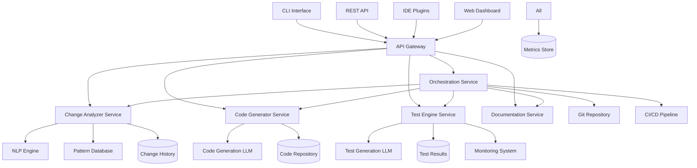

# Change Management System Architecture

This document describes the technical architecture of the intelligent change management system.

## System Architecture Overview



## Core Components

### 1. Change Analyzer Service

```go
// Service definition
type ChangeAnalyzerService struct {
    nlpEngine    NLPEngine
    patternDB    PatternDatabase
    codeAnalyzer CodeAnalyzer
    riskAssessor RiskAssessor
}

// Main analysis endpoint
func (s *ChangeAnalyzerService) AnalyzeChange(ctx context.Context, req AnalyzeRequest) (*AnalysisResult, error) {
    // Parse natural language description
    intent, err := s.nlpEngine.ParseIntent(req.Description)
    if err != nil {
        return nil, fmt.Errorf("intent parsing failed: %w", err)
    }
    
    // Find similar historical changes
    similar := s.patternDB.FindSimilar(intent, 10)
    
    // Analyze codebase impact
    impact, err := s.codeAnalyzer.AnalyzeImpact(intent, req.Repository)
    if err != nil {
        return nil, fmt.Errorf("impact analysis failed: %w", err)
    }
    
    // Assess risk level
    risk := s.riskAssessor.CalculateRisk(impact, similar)
    
    return &AnalysisResult{
        Intent:          intent,
        Impact:          impact,
        Risk:            risk,
        SimilarChanges:  similar,
        Recommendations: s.generateRecommendations(intent, impact, risk),
    }, nil
}

// Pattern matching for common changes
func (s *ChangeAnalyzerService) generateRecommendations(intent Intent, impact Impact, risk Risk) []Recommendation {
    recommendations := []Recommendation{}
    
    // High-risk changes need gradual rollout
    if risk.Level >= RiskHigh {
        recommendations = append(recommendations, Recommendation{
            Type:        "deployment_strategy",
            Suggestion:  "Use feature flags for gradual rollout",
            Confidence:  0.95,
        })
    }
    
    // Breaking changes need compatibility layer
    if impact.BreakingChanges > 0 {
        recommendations = append(recommendations, Recommendation{
            Type:        "compatibility",
            Suggestion:  "Implement compatibility bridge pattern",
            Confidence:  0.88,
        })
    }
    
    return recommendations
}
```

### 2. Code Generator Service

```go
type CodeGeneratorService struct {
    llm           CodeGenerationLLM
    templateStore TemplateStore
    validator     CodeValidator
    formatter     CodeFormatter
}

func (s *CodeGeneratorService) GenerateImplementation(ctx context.Context, req GenerateRequest) (*GeneratedCode, error) {
    // Select appropriate templates
    templates := s.templateStore.SelectTemplates(req.ChangeType, req.Language)
    
    // Generate code using LLM
    prompt := s.buildPrompt(req.Analysis, templates)
    rawCode, err := s.llm.Generate(ctx, prompt)
    if err != nil {
        return nil, fmt.Errorf("LLM generation failed: %w", err)
    }
    
    // Validate generated code
    validationResult := s.validator.Validate(rawCode, req.Language)
    if !validationResult.IsValid {
        // Attempt to fix validation errors
        fixedCode, err := s.llm.FixErrors(ctx, rawCode, validationResult.Errors)
        if err != nil {
            return nil, fmt.Errorf("error fixing failed: %w", err)
        }
        rawCode = fixedCode
    }
    
    // Format code according to language standards
    formattedCode := s.formatter.Format(rawCode, req.Language)
    
    return &GeneratedCode{
        Files:      s.organizeIntoFiles(formattedCode, req.Analysis),
        Language:   req.Language,
        Confidence: s.calculateConfidence(validationResult),
    }, nil
}

// Template-based prompt building
func (s *CodeGeneratorService) buildPrompt(analysis AnalysisResult, templates []Template) string {
    prompt := strings.Builder{}
    
    prompt.WriteString("Generate implementation for the following change:\n")
    prompt.WriteString(fmt.Sprintf("Type: %s\n", analysis.Intent.Type))
    prompt.WriteString(fmt.Sprintf("Description: %s\n", analysis.Intent.Description))
    
    prompt.WriteString("\nAffected components:\n")
    for _, component := range analysis.Impact.Components {
        prompt.WriteString(fmt.Sprintf("- %s\n", component))
    }
    
    prompt.WriteString("\nUse these patterns:\n")
    for _, template := range templates {
        prompt.WriteString(fmt.Sprintf("- %s: %s\n", template.Name, template.Description))
    }
    
    return prompt.String()
}
```

### 3. Test Engine Service

```go
type TestEngineService struct {
    testFinder    TestFinder
    testGenerator TestGenerator
    testRunner    TestRunner
    testAnalyzer  TestAnalyzer
    llm          TestGenerationLLM
}

func (s *TestEngineService) UpdateTests(ctx context.Context, req UpdateTestsRequest) (*TestUpdateResult, error) {
    // Find affected tests
    affectedTests, err := s.testFinder.FindAffected(req.Analysis, req.Repository)
    if err != nil {
        return nil, fmt.Errorf("test finding failed: %w", err)
    }
    
    // Generate test update plans
    updatePlans := make([]TestUpdatePlan, 0, len(affectedTests))
    for _, test := range affectedTests {
        plan, err := s.generateUpdatePlan(ctx, test, req.Analysis)
        if err != nil {
            log.Printf("Failed to generate plan for %s: %v", test.Path, err)
            continue
        }
        updatePlans = append(updatePlans, plan)
    }
    
    // Apply test updates
    updateResults := s.applyUpdates(ctx, updatePlans)
    
    // Generate new tests if needed
    newTests, err := s.generateNewTests(ctx, req.Analysis, affectedTests)
    if err != nil {
        log.Printf("New test generation failed: %v", err)
    }
    
    // Run updated tests
    testResults := s.runTests(ctx, append(updateResults.UpdatedTests, newTests...))
    
    // Analyze failures and generate fixes
    if testResults.HasFailures() {
        fixes := s.analyzeAndFix(ctx, testResults.Failures, req.Analysis)
        testResults = s.applyFixesAndRerun(ctx, fixes)
    }
    
    return &TestUpdateResult{
        UpdatedTests: updateResults.UpdatedTests,
        NewTests:     newTests,
        TestResults:  testResults,
        Coverage:     s.calculateCoverage(testResults),
    }, nil
}

// AI-powered test generation
func (s *TestEngineService) generateNewTests(ctx context.Context, analysis AnalysisResult, existingTests []Test) ([]Test, error) {
    prompt := s.buildTestGenerationPrompt(analysis, existingTests)
    
    generatedTests, err := s.llm.GenerateTests(ctx, prompt)
    if err != nil {
        return nil, fmt.Errorf("LLM test generation failed: %w", err)
    }
    
    // Validate and refine generated tests
    validTests := make([]Test, 0, len(generatedTests))
    for _, test := range generatedTests {
        if s.validateTest(test) {
            validTests = append(validTests, test)
        }
    }
    
    return validTests, nil
}
```

### 4. Orchestration Service

```go
type OrchestrationService struct {
    analyzer      ChangeAnalyzerService
    generator     CodeGeneratorService
    testEngine    TestEngineService
    docService    DocumentationService
    stateManager  StateManager
    eventBus      EventBus
}

func (s *OrchestrationService) ExecuteChange(ctx context.Context, req ChangeRequest) (*ChangeResult, error) {
    // Initialize change execution state
    state := s.stateManager.CreateState(req.ID)
    defer s.stateManager.SaveState(state)
    
    // Phase 1: Analysis
    s.eventBus.Publish(ChangeEvent{Type: "analysis_started", ChangeID: req.ID})
    analysis, err := s.analyzer.AnalyzeChange(ctx, AnalyzeRequest{
        Description: req.Description,
        Repository:  req.Repository,
    })
    if err != nil {
        return nil, s.handleError(state, "analysis", err)
    }
    state.Analysis = analysis
    
    // Phase 2: Code Generation
    s.eventBus.Publish(ChangeEvent{Type: "generation_started", ChangeID: req.ID})
    code, err := s.generator.GenerateImplementation(ctx, GenerateRequest{
        Analysis: analysis,
        Language: req.Language,
    })
    if err != nil {
        return nil, s.handleError(state, "generation", err)
    }
    state.GeneratedCode = code
    
    // Phase 3: Test Updates
    s.eventBus.Publish(ChangeEvent{Type: "test_update_started", ChangeID: req.ID})
    testResult, err := s.testEngine.UpdateTests(ctx, UpdateTestsRequest{
        Analysis:   analysis,
        Repository: req.Repository,
    })
    if err != nil {
        return nil, s.handleError(state, "test_update", err)
    }
    state.TestResults = testResult
    
    // Phase 4: Documentation
    s.eventBus.Publish(ChangeEvent{Type: "documentation_started", ChangeID: req.ID})
    docs, err := s.docService.GenerateDocumentation(ctx, DocRequest{
        Analysis: analysis,
        Code:     code,
        Tests:    testResult,
    })
    if err != nil {
        return nil, s.handleError(state, "documentation", err)
    }
    state.Documentation = docs
    
    // Phase 5: Validation
    validationResult := s.validateChange(state)
    if !validationResult.IsValid {
        return nil, fmt.Errorf("validation failed: %v", validationResult.Errors)
    }
    
    // Phase 6: Apply Changes
    applyResult, err := s.applyChanges(ctx, state)
    if err != nil {
        return nil, s.handleError(state, "apply", err)
    }
    
    s.eventBus.Publish(ChangeEvent{Type: "change_completed", ChangeID: req.ID})
    
    return &ChangeResult{
        ID:            req.ID,
        Status:        "completed",
        Analysis:      analysis,
        GeneratedCode: code,
        TestResults:   testResult,
        Documentation: docs,
        ApplyResult:   applyResult,
    }, nil
}

// Intelligent retry logic with backoff
func (s *OrchestrationService) retryWithBackoff(ctx context.Context, operation func() error) error {
    backoff := 1 * time.Second
    maxRetries := 3
    
    for i := 0; i < maxRetries; i++ {
        err := operation()
        if err == nil {
            return nil
        }
        
        if i < maxRetries-1 {
            log.Printf("Operation failed, retrying in %v: %v", backoff, err)
            time.Sleep(backoff)
            backoff *= 2
        }
    }
    
    return fmt.Errorf("operation failed after %d retries", maxRetries)
}
```

## AI/ML Components

### 1. NLP Engine

```go
type NLPEngine struct {
    tokenizer    Tokenizer
    embedder     TextEmbedder
    classifier   IntentClassifier
    entityExtractor EntityExtractor
}

func (e *NLPEngine) ParseIntent(description string) (Intent, error) {
    // Tokenize input
    tokens := e.tokenizer.Tokenize(description)
    
    // Generate embeddings
    embeddings := e.embedder.Embed(tokens)
    
    // Classify intent type
    intentType := e.classifier.Classify(embeddings)
    
    // Extract entities
    entities := e.entityExtractor.Extract(tokens, embeddings)
    
    return Intent{
        Type:        intentType,
        Description: description,
        Entities:    entities,
        Confidence:  e.calculateConfidence(embeddings),
    }, nil
}
```

### 2. Pattern Database

```go
type PatternDatabase struct {
    db           *sql.DB
    vectorStore  VectorStore
    cache        Cache
}

func (p *PatternDatabase) FindSimilar(intent Intent, limit int) []HistoricalChange {
    // Generate query vector
    queryVector := p.vectorize(intent)
    
    // Search vector store
    similarities := p.vectorStore.SearchSimilar(queryVector, limit*2)
    
    // Load full change records
    changes := make([]HistoricalChange, 0, limit)
    for _, sim := range similarities {
        change, err := p.loadChange(sim.ID)
        if err != nil {
            continue
        }
        
        // Apply additional filters
        if p.isRelevant(change, intent) {
            changes = append(changes, change)
            if len(changes) >= limit {
                break
            }
        }
    }
    
    return changes
}

// Learn from new changes
func (p *PatternDatabase) LearnFromChange(change CompletedChange) error {
    // Extract patterns
    patterns := p.extractPatterns(change)
    
    // Update vector store
    vector := p.vectorize(change.Intent)
    if err := p.vectorStore.Insert(change.ID, vector); err != nil {
        return err
    }
    
    // Update pattern statistics
    for _, pattern := range patterns {
        if err := p.updatePatternStats(pattern, change.Outcome); err != nil {
            return err
        }
    }
    
    // Clear relevant caches
    p.cache.InvalidatePrefix("similar_changes")
    
    return nil
}
```

### 3. Code Generation LLM

```go
type CodeGenerationLLM struct {
    model       LLMModel
    tokenizer   CodeTokenizer
    validator   SyntaxValidator
    cache       ResponseCache
}

func (l *CodeGenerationLLM) Generate(ctx context.Context, prompt string) (string, error) {
    // Check cache
    cacheKey := l.generateCacheKey(prompt)
    if cached, found := l.cache.Get(cacheKey); found {
        return cached, nil
    }
    
    // Tokenize prompt
    tokens := l.tokenizer.Tokenize(prompt)
    
    // Generate completion
    response, err := l.model.Complete(ctx, tokens, ModelOptions{
        Temperature:  0.2,
        MaxTokens:    2048,
        TopP:         0.95,
        StopTokens:   []string{"```", "END_CODE"},
    })
    if err != nil {
        return "", fmt.Errorf("model completion failed: %w", err)
    }
    
    // Extract code from response
    code := l.extractCode(response)
    
    // Validate syntax
    if !l.validator.IsValid(code) {
        // Attempt to fix syntax errors
        code, err = l.fixSyntax(ctx, code)
        if err != nil {
            return "", fmt.Errorf("syntax fixing failed: %w", err)
        }
    }
    
    // Cache successful response
    l.cache.Set(cacheKey, code, 1*time.Hour)
    
    return code, nil
}

// Self-healing code generation
func (l *CodeGenerationLLM) fixSyntax(ctx context.Context, code string) (string, error) {
    errors := l.validator.GetErrors(code)
    
    fixPrompt := fmt.Sprintf(`Fix the following syntax errors in this code:
Code:
%s

Errors:
%s

Provide the corrected code:`, code, errors)
    
    fixedCode, err := l.Generate(ctx, fixPrompt)
    if err != nil {
        return "", err
    }
    
    // Verify fix worked
    if !l.validator.IsValid(fixedCode) {
        return "", fmt.Errorf("unable to fix syntax errors")
    }
    
    return fixedCode, nil
}
```

## Data Architecture

### 1. Change History Database

```sql
-- Change records
CREATE TABLE changes (
    id UUID PRIMARY KEY,
    description TEXT NOT NULL,
    intent_type VARCHAR(50),
    risk_level VARCHAR(20),
    status VARCHAR(30),
    created_at TIMESTAMP DEFAULT NOW(),
    completed_at TIMESTAMP,
    
    -- Analysis results
    analysis_result JSONB,
    
    -- Generated artifacts
    generated_code JSONB,
    test_results JSONB,
    documentation JSONB,
    
    -- Metrics
    iterations INTEGER DEFAULT 0,
    duration_seconds INTEGER,
    lines_changed INTEGER,
    tests_updated INTEGER,
    
    -- Outcome
    success BOOLEAN,
    rollback_required BOOLEAN,
    failure_reason TEXT
);

-- Pattern tracking
CREATE TABLE patterns (
    id UUID PRIMARY KEY,
    pattern_type VARCHAR(50),
    description TEXT,
    occurrences INTEGER DEFAULT 0,
    success_rate DECIMAL(3,2),
    avg_duration_seconds INTEGER,
    
    -- Pattern details
    conditions JSONB,
    recommendations JSONB,
    
    created_at TIMESTAMP DEFAULT NOW(),
    updated_at TIMESTAMP DEFAULT NOW()
);

-- Test evolution tracking
CREATE TABLE test_evolution (
    id UUID PRIMARY KEY,
    change_id UUID REFERENCES changes(id),
    test_path TEXT,
    operation VARCHAR(20), -- created, updated, deleted
    
    -- Before/after states
    original_content TEXT,
    updated_content TEXT,
    
    -- Metrics
    coverage_before DECIMAL(3,2),
    coverage_after DECIMAL(3,2),
    execution_time_ms INTEGER,
    
    created_at TIMESTAMP DEFAULT NOW()
);
```

### 2. Metrics and Monitoring

```go
type MetricsCollector struct {
    store MetricsStore
    agg   MetricsAggregator
}

func (m *MetricsCollector) RecordChange(change CompletedChange) error {
    metrics := ChangeMetrics{
        ChangeID:        change.ID,
        Duration:        change.Duration,
        Iterations:      change.Iterations,
        LinesChanged:    change.Stats.LinesChanged,
        TestsUpdated:    change.Stats.TestsUpdated,
        TestsAdded:      change.Stats.TestsAdded,
        CoverageChange:  change.Stats.CoverageAfter - change.Stats.CoverageBefore,
        Success:         change.Success,
    }
    
    // Store raw metrics
    if err := m.store.Record(metrics); err != nil {
        return err
    }
    
    // Update aggregates
    m.agg.UpdateHourly(metrics)
    m.agg.UpdateDaily(metrics)
    
    // Update pattern success rates
    if err := m.updatePatternMetrics(change); err != nil {
        return err
    }
    
    return nil
}

// Real-time monitoring
func (m *MetricsCollector) GetDashboardMetrics() DashboardMetrics {
    return DashboardMetrics{
        ActiveChanges:       m.store.CountActive(),
        SuccessRate24h:      m.agg.GetSuccessRate(24 * time.Hour),
        AvgDuration24h:      m.agg.GetAvgDuration(24 * time.Hour),
        TopFailureReasons:   m.agg.GetTopFailures(5),
        PatternSuccessRates: m.agg.GetPatternRates(),
    }
}
```

## Security Architecture

### 1. Authentication and Authorization

```go
type SecurityLayer struct {
    authProvider  AuthProvider
    authzProvider AuthzProvider
    auditLog     AuditLogger
}

func (s *SecurityLayer) AuthorizeChange(ctx context.Context, req ChangeRequest) error {
    // Extract user identity
    user, err := s.authProvider.GetUser(ctx)
    if err != nil {
        return fmt.Errorf("authentication failed: %w", err)
    }
    
    // Check permissions
    permissions := s.authzProvider.GetPermissions(user, req.Repository)
    if !permissions.CanModifyCode {
        s.auditLog.LogUnauthorized(user, req, "modify_code")
        return fmt.Errorf("insufficient permissions")
    }
    
    // Additional checks for high-risk changes
    if req.Analysis.Risk.Level >= RiskHigh && !permissions.CanApproveHighRisk {
        s.auditLog.LogUnauthorized(user, req, "high_risk_change")
        return fmt.Errorf("high-risk changes require additional approval")
    }
    
    // Log authorized action
    s.auditLog.LogAuthorized(user, req)
    
    return nil
}
```

### 2. Audit Trail

```go
type AuditLogger struct {
    db EventStore
}

func (a *AuditLogger) LogChangeEvent(event ChangeEvent) error {
    return a.db.Store(AuditEvent{
        Type:      "change_event",
        Timestamp: time.Now(),
        UserID:    event.UserID,
        ChangeID:  event.ChangeID,
        Action:    event.Type,
        Details:   event.Details,
        IPAddress: event.IPAddress,
    })
}
```

## Deployment Architecture

### 1. Container Structure

```yaml
# docker-compose.yml
version: '3.8'

services:
  gateway:
    image: mcp-change/gateway:latest
    ports:
      - "8080:8080"
    environment:
      - SERVICE_DISCOVERY_URL=http://consul:8500
    
  analyzer:
    image: mcp-change/analyzer:latest
    deploy:
      replicas: 3
    environment:
      - NLP_MODEL_URL=http://nlp-engine:8000
      - DB_URL=postgresql://db:5432/changes
    
  generator:
    image: mcp-change/generator:latest
    deploy:
      replicas: 2
    environment:
      - LLM_ENDPOINT=http://llm-service:8000
      - TEMPLATE_STORE_URL=http://templates:8080
    
  test-engine:
    image: mcp-change/test-engine:latest
    deploy:
      replicas: 3
    environment:
      - TEST_LLM_ENDPOINT=http://test-llm:8000
      - TEST_RUNNER_POOL_SIZE=10
    
  orchestrator:
    image: mcp-change/orchestrator:latest
    deploy:
      replicas: 2
    environment:
      - STATE_STORE_URL=redis://redis:6379
      - EVENT_BUS_URL=nats://nats:4222
```

### 2. Kubernetes Deployment

```yaml
# k8s/deployment.yaml
apiVersion: apps/v1
kind: Deployment
metadata:
  name: change-analyzer
spec:
  replicas: 3
  selector:
    matchLabels:
      app: change-analyzer
  template:
    metadata:
      labels:
        app: change-analyzer
    spec:
      containers:
      - name: analyzer
        image: mcp-change/analyzer:v1.0.0
        resources:
          requests:
            memory: "512Mi"
            cpu: "500m"
          limits:
            memory: "1Gi"
            cpu: "1000m"
        env:
        - name: NLP_MODEL_URL
          valueFrom:
            configMapKeyRef:
              name: analyzer-config
              key: nlp_model_url
---
apiVersion: v1
kind: Service
metadata:
  name: change-analyzer
spec:
  selector:
    app: change-analyzer
  ports:
  - port: 8080
    targetPort: 8080
---
apiVersion: autoscaling/v2
kind: HorizontalPodAutoscaler
metadata:
  name: change-analyzer-hpa
spec:
  scaleTargetRef:
    apiVersion: apps/v1
    kind: Deployment
    name: change-analyzer
  minReplicas: 3
  maxReplicas: 10
  metrics:
  - type: Resource
    resource:
      name: cpu
      target:
        type: Utilization
        averageUtilization: 70
```

## Performance Optimization

### 1. Caching Strategy

```go
type CacheManager struct {
    local       LocalCache
    distributed RedisCache
    preloader   CachePreloader
}

func (c *CacheManager) Get(key string) (interface{}, bool) {
    // Try local cache first
    if val, found := c.local.Get(key); found {
        return val, true
    }
    
    // Try distributed cache
    if val, found := c.distributed.Get(key); found {
        // Populate local cache
        c.local.Set(key, val, 5*time.Minute)
        return val, true
    }
    
    return nil, false
}

// Predictive cache preloading
func (c *CacheManager) PreloadPredictive(changeType string) {
    patterns := c.preloader.PredictPatterns(changeType)
    
    for _, pattern := range patterns {
        go func(p Pattern) {
            data := c.loadPatternData(p)
            c.distributed.Set(p.CacheKey(), data, 1*time.Hour)
        }(pattern)
    }
}
```

### 2. Resource Pooling

```go
type ResourcePool struct {
    llmConnections   sync.Pool
    testRunners      chan TestRunner
    codeValidators   chan CodeValidator
}

func NewResourcePool(config PoolConfig) *ResourcePool {
    pool := &ResourcePool{
        testRunners:    make(chan TestRunner, config.TestRunnerCount),
        codeValidators: make(chan CodeValidator, config.ValidatorCount),
    }
    
    // Initialize LLM connection pool
    pool.llmConnections = sync.Pool{
        New: func() interface{} {
            return NewLLMConnection(config.LLMEndpoint)
        },
    }
    
    // Pre-populate test runners
    for i := 0; i < config.TestRunnerCount; i++ {
        pool.testRunners <- NewTestRunner(i)
    }
    
    return pool
}
```

## Observability

### 1. Distributed Tracing

```go
type TracingMiddleware struct {
    tracer opentracing.Tracer
}

func (t *TracingMiddleware) TraceChange(next ChangeHandler) ChangeHandler {
    return func(ctx context.Context, req ChangeRequest) (*ChangeResult, error) {
        span := t.tracer.StartSpan(
            "change.execute",
            opentracing.ChildOf(opentracing.SpanFromContext(ctx).Context()),
        )
        defer span.Finish()
        
        span.SetTag("change.id", req.ID)
        span.SetTag("change.type", req.Type)
        
        ctx = opentracing.ContextWithSpan(ctx, span)
        
        result, err := next(ctx, req)
        
        if err != nil {
            span.SetTag("error", true)
            span.LogFields(
                log.String("error.message", err.Error()),
            )
        }
        
        return result, err
    }
}
```

### 2. Health Checks

```go
type HealthChecker struct {
    services []HealthCheckable
}

func (h *HealthChecker) CheckHealth() HealthStatus {
    status := HealthStatus{
        Status: "healthy",
        Services: make(map[string]ServiceHealth),
    }
    
    for _, service := range h.services {
        serviceHealth := service.HealthCheck()
        status.Services[service.Name()] = serviceHealth
        
        if serviceHealth.Status != "healthy" {
            status.Status = "degraded"
        }
    }
    
    return status
}
```

This architecture provides a scalable, reliable, and intelligent system for automated change management in software development.