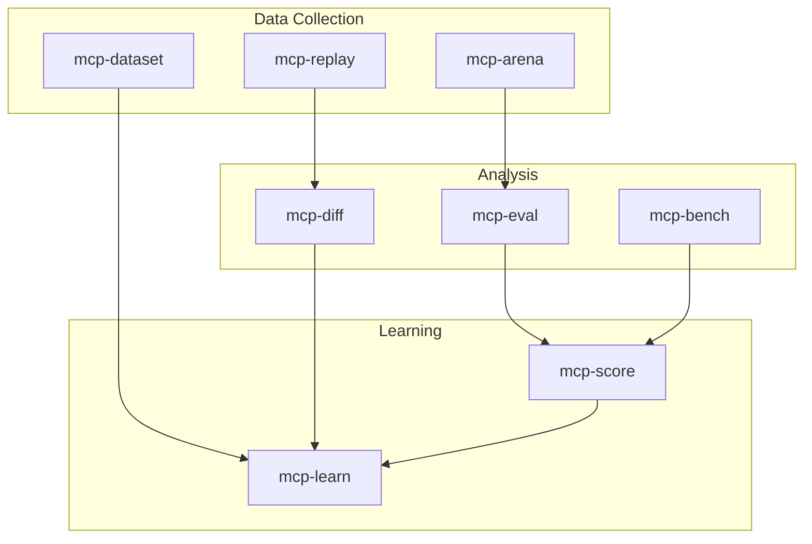

# MCP Evaluation Tools

Tools for evaluating and comparing programming agents using different MCP servers, building datasets for optimization.

## 🎯 Priority Evaluation Tools

### 1. **mcp-arena**: Agent Competition Framework
**Purpose**: Run programming agents head-to-head on identical tasks
```bash
# Run two agents on the same task
mcp-arena compete agent1.json agent2.json --task="implement binary search"

# Run tournament across multiple tasks
mcp-arena tournament agents/*.json --tasks=tasks/*.yaml

# Compare same agent with different servers
mcp-arena compare claude.json --servers=time-server,weather-server
```

**Features**:
- Task definition language (YAML/JSON)
- Time/resource limits
- Code quality metrics
- Success criteria validation
- Performance benchmarking
- Replay capability

### 2. **mcp-eval**: Evaluation Framework
**Purpose**: Systematically evaluate agent performance
```bash
# Evaluate agent on test suite
mcp-eval run agent.json --suite=coding-tasks.yaml

# Compare multiple runs
mcp-eval compare run1.json run2.json

# Generate performance report
mcp-eval report runs/*.json --output=report.html
```

**Metrics Collected**:
- Task completion rate
- Time to solution
- Code quality (via linters)
- Test coverage
- Resource usage
- Error rates
- Retry patterns

### 3. **mcp-dataset**: Dataset Builder
**Purpose**: Create training/evaluation datasets from agent interactions
```bash
# Record agent interactions
mcp-dataset record agent.json --tasks=tasks/*.yaml

# Extract successful patterns
mcp-dataset extract --filter=success patterns.json

# Generate training data
mcp-dataset generate --from=runs/*.json --format=jsonl
```

**Dataset Features**:
- Task descriptions
- Agent interactions
- Solution quality metrics
- Error patterns
- Performance characteristics
- Context requirements

### 4. **mcp-bench**: MCP Server Benchmarking
**Purpose**: Benchmark MCP server performance under load
```bash
# Benchmark server response times
mcp-bench latency time-server --concurrent=10

# Test throughput limits
mcp-bench throughput weather-server --duration=60s

# Stress test with mixed workload
mcp-bench stress server.json --workload=mixed.yaml
```

**Measurements**:
- Response latency (p50, p95, p99)
- Throughput (requests/second)
- Error rates under load
- Resource consumption
- Connection handling
- Memory leaks

### 5. **mcp-diff**: Behavior Differential Analysis
**Purpose**: Compare agent behaviors across different configurations
```bash
# Compare agent outputs
mcp-diff trace agent1.mcp agent2.mcp

# Analyze decision differences
mcp-diff decisions run1.json run2.json

# Find behavioral patterns
mcp-diff patterns runs/*.json --cluster
```

**Analysis Types**:
- Output differences
- Decision tree variations
- Error pattern analysis
- Performance deltas
- Resource usage comparison
- Strategy identification

### 6. **mcp-replay**: Interaction Replay Engine
**Purpose**: Replay and modify agent interactions
```bash
# Replay interaction with different server
mcp-replay run.mcp --server=new-server

# Modify and replay
mcp-replay edit run.mcp --change="step[5].input"

# A/B test server changes
mcp-replay ab-test runs/*.mcp --server-a=v1 --server-b=v2
```

**Capabilities**:
- Exact replay
- Parametric modifications
- A/B testing
- Performance comparison
- Regression detection
- Debugging support

### 7. **mcp-score**: Scoring and Ranking System
**Purpose**: Score and rank agent/server combinations
```bash
# Score a run
mcp-score evaluate run.json --rubric=quality.yaml

# Rank multiple agents
mcp-score rank agents/*.json --tasks=benchmark/*.yaml

# Leaderboard generation
mcp-score leaderboard --from=runs/*.json
```

**Scoring Dimensions**:
- Correctness
- Efficiency
- Code quality
- Resource usage
- Time to completion
- Robustness

### 8. **mcp-learn**: Learning from Evaluations
**Purpose**: Extract insights and patterns from evaluation data
```bash
# Find optimal strategies
mcp-learn strategies --from=successful/*.json

# Identify failure patterns
mcp-learn failures --from=failed/*.json

# Generate recommendations
mcp-learn recommend --for=task.yaml --from=dataset/
```

**Learning Outputs**:
- Strategy patterns
- Common pitfalls
- Optimal configurations
- Performance predictors
- Task-specific insights
- Server selection guidance

## Evaluation Workflows

### 1. **Continuous Evaluation Pipeline**
```yaml
pipeline:
  - stage: generate_tasks
    tool: mcp-dataset
    action: generate --template=coding_tasks
    
  - stage: run_agents
    tool: mcp-arena
    action: compete agents/*.json --tasks=generated/*.yaml
    
  - stage: evaluate_results
    tool: mcp-eval
    action: run --suite=results/*.json
    
  - stage: update_scores
    tool: mcp-score
    action: leaderboard --update
    
  - stage: learn_patterns
    tool: mcp-learn
    action: extract --from=today/*.json
```

### 2. **A/B Testing Workflow**
```yaml
experiment:
  - stage: baseline
    tool: mcp-arena
    config: 
      agent: claude.json
      server: mcp-server-v1
      tasks: benchmark/*.yaml
      
  - stage: variant
    tool: mcp-arena
    config:
      agent: claude.json
      server: mcp-server-v2
      tasks: benchmark/*.yaml
      
  - stage: analysis
    tool: mcp-diff
    action: compare baseline.json variant.json
    
  - stage: significance
    tool: mcp-score
    action: statistical-test baseline.json variant.json
```

### 3. **Dataset Building Workflow**
```yaml
dataset_pipeline:
  - stage: collect
    tool: mcp-dataset
    action: record --agents=all --tasks=diverse
    
  - stage: filter
    tool: mcp-eval
    action: filter --min-score=0.8
    
  - stage: augment
    tool: mcp-dataset
    action: augment --variations=5
    
  - stage: validate
    tool: mcp-learn
    action: validate --split=80/20
```

## Integration Architecture



## Metrics Framework

### 1. **Task Completion Metrics**
- Success rate
- Partial completion score
- Time to completion
- Number of attempts
- Error recovery rate

### 2. **Code Quality Metrics**
- Syntax correctness
- Test passage rate
- Code coverage
- Linting scores
- Complexity metrics

### 3. **Performance Metrics**
- Execution time
- Memory usage
- API calls made
- Token consumption
- Cache hit rates

### 4. **Behavioral Metrics**
- Strategy consistency
- Error handling patterns
- Help-seeking behavior
- Tool usage patterns
- Learning curves

## Use Cases

### 1. **MCP Server Optimization**
```bash
# Test server changes
mcp-replay ab-test corpus/*.mcp --server-a=current --server-b=optimized

# Measure improvement
mcp-score compare results-a.json results-b.json
```

### 2. **Agent Training**
```bash
# Build training dataset
mcp-dataset generate --from=successful/*.json --format=training

# Evaluate on holdout
mcp-eval run trained-agent.json --suite=test-set.yaml
```

### 3. **Competition/Benchmarking**
```bash
# Run competition
mcp-arena tournament agents/*.json --tasks=competition/*.yaml

# Generate leaderboard
mcp-score leaderboard --from=results/*.json --public
```

### 4. **Debugging/Analysis**
```bash
# Find failure patterns
mcp-learn failures --from=errors/*.json

# Replay with debugging
mcp-replay debug failure.mcp --breakpoint=step[5]
```

## Success Metrics

1. **Dataset Quality**
   - Size: 10k+ high-quality interactions
   - Diversity: 100+ task types
   - Coverage: All error patterns captured

2. **Evaluation Accuracy**
   - Correlation with human judgment: >0.9
   - Reproducibility: 100%
   - Statistical significance: p<0.01

3. **Performance Impact**
   - 50% reduction in evaluation time
   - 10x increase in test coverage
   - 90% automation of benchmarking

4. **Learning Effectiveness**
   - 30% improvement in agent performance
   - 80% reduction in error rates
   - 2x faster optimization cycles