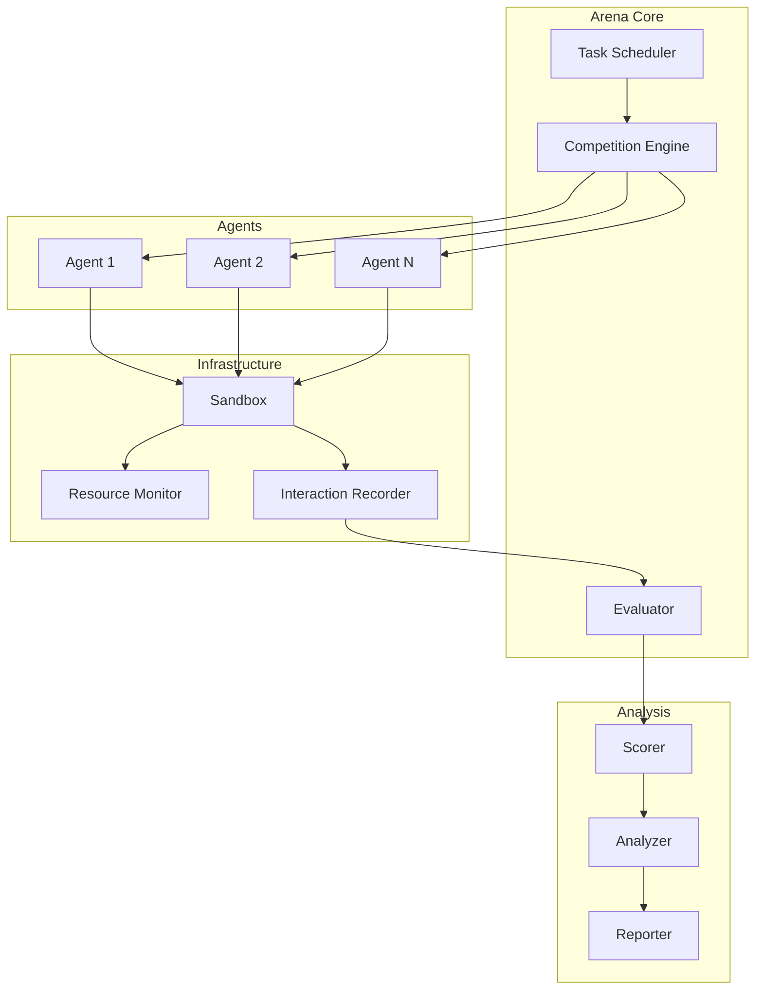

# Implementation Plan: mcp-arena

## Overview
`mcp-arena` is the core evaluation tool that enables head-to-head comparison of programming agents and MCP servers, building the foundation for data-driven optimization.

## Core Components

### 1. Task Definition System
```yaml
# task.yaml
name: "Binary Search Implementation"
description: "Implement binary search for a sorted array"
language: "go"
timeout: 300s
resources:
  memory: "512Mi"
  cpu: "1.0"
validation:
  type: "test"
  tests:
    - input: "[1,2,3,4,5], 3"
      expected: "2"
    - input: "[1,2,3,4,5], 6"
      expected: "-1"
  performance:
    max_time: "100ms"
    max_memory: "10MB"
```

### 2. Agent Configuration
```json
{
  "name": "Claude-3",
  "type": "anthropic",
  "config": {
    "api_key": "${ANTHROPIC_API_KEY}",
    "model": "claude-3-opus-20240229",
    "temperature": 0.0
  },
  "mcp_servers": [
    {
      "name": "code-assistant",
      "command": "mcp-code-server",
      "args": ["--language=go"]
    }
  ]
}
```

### 3. Competition Engine
```go
type Arena struct {
    agents    map[string]Agent
    tasks     []Task
    evaluator Evaluator
    recorder  Recorder
}

type Competition struct {
    ID        string
    Agents    []string
    Task      Task
    StartTime time.Time
    Results   []Result
}

type Result struct {
    AgentID      string
    Success      bool
    Score        float64
    Duration     time.Duration
    Interactions []Interaction
    Metrics      map[string]interface{}
}
```

## Architecture



## Implementation Phases

### Phase 1: Basic Competition (Week 1-2)

1. **Task Runner**
   ```go
   func (a *Arena) RunTask(agent Agent, task Task) (*Result, error) {
       // Create sandbox environment
       sandbox := NewSandbox(task.Resources)
       
       // Initialize agent with MCP servers
       if err := agent.Initialize(sandbox); err != nil {
           return nil, err
       }
       
       // Start recording
       recorder := NewRecorder()
       agent.SetRecorder(recorder)
       
       // Execute task
       ctx, cancel := context.WithTimeout(context.Background(), task.Timeout)
       defer cancel()
       
       start := time.Now()
       output, err := agent.Execute(ctx, task)
       duration := time.Since(start)
       
       // Evaluate result
       score := a.evaluator.Evaluate(task, output)
       
       return &Result{
           AgentID:      agent.ID,
           Success:      err == nil,
           Score:        score,
           Duration:     duration,
           Interactions: recorder.GetInteractions(),
       }, nil
   }
   ```

2. **Sandbox Environment**
   - Docker container isolation
   - Resource limits enforcement
   - Network restrictions
   - File system isolation

3. **Basic Scoring**
   - Binary success/failure
   - Time to completion
   - Resource usage
   - Test passage rate

### Phase 2: Advanced Evaluation (Week 3-4)

1. **Multi-Agent Competition**
   ```go
   func (a *Arena) Competition(agents []Agent, task Task) *Competition {
       comp := &Competition{
           ID:        uuid.New(),
           Task:      task,
           StartTime: time.Now(),
       }
       
       // Run agents in parallel
       results := make(chan *Result, len(agents))
       for _, agent := range agents {
           go func(ag Agent) {
               result, _ := a.RunTask(ag, task)
               results <- result
           }(agent)
       }
       
       // Collect results
       for i := 0; i < len(agents); i++ {
           comp.Results = append(comp.Results, <-results)
       }
       
       return comp
   }
   ```

2. **Advanced Metrics**
   - Code quality analysis
   - Solution elegance
   - Error handling
   - Performance optimization
   - Memory efficiency

3. **Interaction Analysis**
   - Tool usage patterns
   - Error recovery strategies
   - Help-seeking behavior
   - Iteration patterns

### Phase 3: Tournament System (Week 5-6)

1. **Tournament Modes**
   - Round-robin
   - Elimination
   - Swiss system
   - League format

2. **Ranking System**
   - ELO ratings
   - Glicko-2 ratings
   - Task-specific rankings
   - Overall leaderboards

3. **Dataset Generation**
   ```go
   func (a *Arena) GenerateDataset(competitions []*Competition) *Dataset {
       dataset := &Dataset{
           Version: "1.0",
           Created: time.Now(),
       }
       
       for _, comp := range competitions {
           for _, result := range comp.Results {
               dataset.AddEntry(&DataEntry{
                   Task:         comp.Task,
                   Agent:        result.AgentID,
                   Success:      result.Success,
                   Score:        result.Score,
                   Interactions: result.Interactions,
                   Metrics:      result.Metrics,
               })
           }
       }
       
       return dataset
   }
   ```

## CLI Interface

```bash
# Single competition
mcp-arena compete agent1.json agent2.json --task=binary-search.yaml

# Tournament
mcp-arena tournament agents/*.json --tasks=tasks/*.yaml --format=round-robin

# Continuous evaluation
mcp-arena continuous --agents=registry.yaml --new-tasks-dir=./tasks/

# Generate dataset
mcp-arena dataset --from=results/*.json --output=training-data.jsonl

# View leaderboard
mcp-arena leaderboard --category=algorithms

# Replay competition
mcp-arena replay competition-id --speed=2x

# Compare configurations
mcp-arena compare claude.json --servers=server1,server2 --tasks=benchmark/
```

## Integration Points

1. **With mcp-eval**
   - Sends results for detailed evaluation
   - Receives scoring rubrics
   - Shares metric definitions

2. **With mcp-replay**
   - Records all interactions
   - Enables replay functionality
   - Supports debugging

3. **With mcp-dataset**
   - Exports competition data
   - Generates training sets
   - Creates benchmark suites

4. **With mcp-score**
   - Calculates final scores
   - Updates rankings
   - Generates leaderboards

## Success Metrics

1. **Reliability**
   - 99.9% uptime
   - <1% false positives
   - Consistent scoring

2. **Performance**
   - <5s overhead per task
   - Support 100+ concurrent competitions
   - Handle 1M+ interactions/day

3. **Coverage**
   - 50+ task types
   - 10+ programming languages
   - All major LLM providers

4. **Impact**
   - 10x increase in evaluation speed
   - 90% reduction in manual testing
   - Clear performance insights

## Task Library

### Categories
1. **Algorithms**
   - Sorting algorithms
   - Search algorithms
   - Graph algorithms
   - Dynamic programming

2. **Data Structures**
   - Implementation tasks
   - Operation optimization
   - Memory efficiency

3. **System Design**
   - API design
   - Database schemas
   - Microservices

4. **Real-world Problems**
   - File processing
   - Data transformation
   - API integration
   - Error handling

## Security Considerations

1. **Sandboxing**
   - No network access by default
   - Limited file system access
   - Resource quotas
   - Process isolation

2. **Code Execution**
   - Static analysis before run
   - Runtime monitoring
   - Automatic termination
   - Audit logging

3. **Data Protection**
   - Encrypted storage
   - Access controls
   - Audit trails
   - GDPR compliance

## Future Enhancements

1. **ML Integration**
   - Predict task difficulty
   - Optimize agent matching
   - Auto-generate tasks
   - Performance prediction

2. **Visualization**
   - Real-time dashboards
   - Competition replay
   - Performance graphs
   - Strategy analysis

3. **Community Features**
   - Public competitions
   - User-submitted tasks
   - Agent marketplace
   - Shared datasets