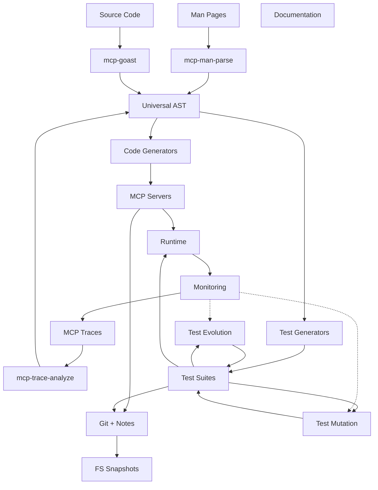

# Integrated MCP Development Toolchain

This document shows how all the MCP tools integrate into a complete development workflow.

## Overview Diagram



## Complete Development Flow

### 1. Initial Development

```bash
# Start with a CLI tool
man git > git.man

# Parse to structured format
mcp-man-parse git > git_commands.json

# Generate MCP schemas
mcp-man2schema git_commands.json > git_tools.json

# Create initial server
mcp-graph2server git_tools.json > git_server.go

# Generate initial tests
mcp-man2test git_commands.json > git_tests.txt
```

### 2. Version Control Integration

```bash
# Create snapshot before changes
mcp-snapshot create pre-dev

# Initialize git with metadata
git init
mcp-git-annotate --tool=mcp-man-parse git_server.go

# Create development worktree
mcp-worktree create feature/git-server

# Track generation metadata
git add git_server.go
git commit -m "Generated from git man pages

$(mcp-git-trace describe)"
```

### 3. Runtime Observation

```bash
# Start server with tracing
mcp-trace-record ./git_server > git_trace.jsonl

# Analyze runtime behavior
mcp-trace-analyze git_trace.jsonl

# Generate additional code from trace
mcp-trace-codegen git_trace.jsonl > git_server_enhanced.go
```

### 4. Test Evolution

```bash
# Evolve tests from trace
mcp-test-evolve --trace=git_trace.jsonl --test=git_tests.txt

# Generate mutations
mcp-test-mutate git_tests_evolved.txt --count=50

# Minimize failures
for f in mutations/fail_*.txt; do
    mcp-test-minimize "$f"
done

# Optimize test suite
mcp-test-optimize git_tests_complete.txt
```

### 5. Cross-Language Support

```bash
# Generate Python version
mcp-py-codegen git_trace.jsonl > git_server.py

# Generate TypeScript version
mcp-ts-codegen git_trace.jsonl > git_server.ts

# Test compatibility
mcp-polyglot-test --server=go:git_server --client=python
```

### 6. Production Deployment

```bash
# Build optimized graph
mcp-graph-optimize git_graph.dot

# Generate deployment artifacts
mcp-docker-gen --language=go git_server.go > Dockerfile

# Create monitoring configuration
mcp-monitor-config git_server > monitoring.yaml
```

## Tool Categories

### Input Processing
- **mcp-man-parse**: Parse man pages
- **mcp-trace-analyze**: Analyze MCP traces
- **mcp-goast**: Parse Go source code
- **mcp-lang-detector**: Detect languages

### Code Generation
- **mcp-trace-codegen**: Generate from traces
- **mcp-graph2server**: Generate from graphs
- **mcp-universal-codegen**: Template-based generation
- **Language-specific**: mcp-py-codegen, mcp-ts-codegen, etc.

### Version Control
- **mcp-git-annotate**: Add generation metadata
- **mcp-git-trace**: Query generation history
- **mcp-worktree**: Manage git worktrees
- **mcp-snapshot**: Filesystem snapshots

### Testing
- **mcp-test-evolve**: Evolve from traces
- **mcp-test-mutate**: Generate variations
- **mcp-test-minimize**: Reduce failures
- **mcp-test-property**: Property-based testing

### Analysis
- **mcp-trace-analyze**: Analyze traces
- **mcp-dep-analyze**: Dependency analysis
- **mcp-graph-analyze**: Graph analysis
- **mcp-test-cover**: Coverage analysis

### Runtime
- **mcp-trace-record**: Record execution
- **mcp-monitor**: Runtime monitoring
- **mcp-bisect**: Debug regressions
- **mcp-replay**: Replay traces

## Example: Complete Feature Development

Here's how all tools work together for developing a new feature:

```bash
# 1. Start with existing tool documentation
mcp-man-parse curl > curl.json

# 2. Create feature branch with worktree
mcp-worktree create feature/curl-mcp

# 3. Generate initial implementation
mcp-man2schema curl.json | mcp-graph2server > curl_server.go

# 4. Generate tests from examples
mcp-man2test curl.json > curl_tests.txt

# 5. Run and trace
mcp-trace-record go run curl_server.go > curl_trace.jsonl

# 6. Enhance based on trace
mcp-trace-codegen curl_trace.jsonl > curl_server_v2.go

# 7. Evolve tests
mcp-test-evolve --trace=curl_trace.jsonl --test=curl_tests.txt

# 8. Check coverage
mcp-test-cover --binary=curl_server --test=curl_tests_evolved.txt

# 9. Generate mutations for edge cases
mcp-test-mutate curl_tests_evolved.txt --strategies=all

# 10. Cross-language generation
mcp-py-codegen curl_trace.jsonl > curl_server.py
mcp-ts-codegen curl_trace.jsonl > curl_server.ts

# 11. Version control with metadata
mcp-git-annotate --trace=curl_trace.jsonl curl_server.go
git add .
git commit -m "Add curl MCP server

Generated from curl man pages and runtime traces"

# 12. Test cross-language compatibility
mcp-polyglot-test \
    --servers go:curl_server python:curl_server.py \
    --test curl_tests_final.txt

# 13. Generate documentation
mcp-graph2docs curl_graph.dot > curl_mcp.md

# 14. Deploy
mcp-docker-gen --language=go curl_server.go > Dockerfile
docker build -t curl-mcp .
```

## Best Practices

### 1. Iterative Development
- Start simple, evolve complexity
- Use traces to guide development
- Test early and often

### 2. Metadata Tracking
- Annotate all generated code
- Track tool versions
- Document decision rationale

### 3. Test Evolution
- Begin with documentation examples
- Evolve from runtime behavior
- Mutate for edge cases
- Minimize failures quickly

### 4. Version Control
- Use worktrees for experiments
- Snapshot before major changes
- Commit metadata with code

### 5. Cross-Language
- Generate multiple implementations
- Test compatibility
- Share test suites

## Future Enhancements

### 1. AI Integration
- Natural language to MCP tools
- Intelligent test generation
- Automated debugging

### 2. Cloud Services
- Distributed test evolution
- Shared tool registry
- Collaborative development

### 3. IDE Integration
- Real-time generation
- Inline documentation
- Visual debugging

### 4. Performance
- Optimized code generation
- Parallel test execution
- Caching strategies

## Conclusion

This integrated toolchain provides:
1. **Automatic generation** from documentation
2. **Evolution** from runtime behavior
3. **Robust testing** through mutation
4. **Version control** with full metadata
5. **Cross-language** support
6. **Production-ready** deployment

The tools work together to create a complete development workflow from initial concept to production deployment.