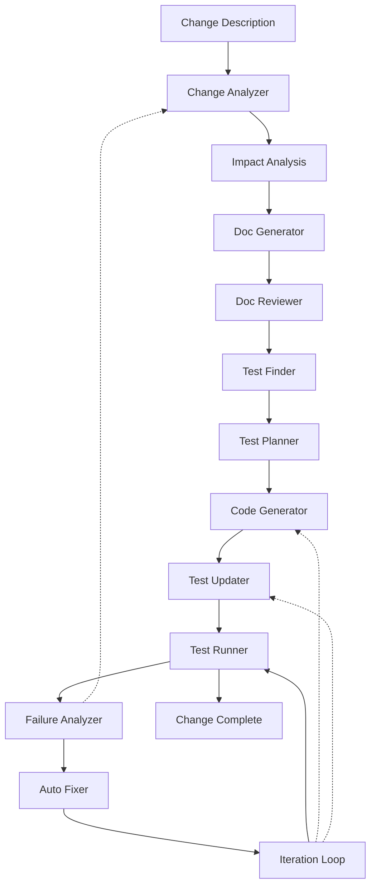

# Intelligent Change Management System for MCP

This document describes an AI-powered system that automates the entire development workflow from change description to resolution.

## System Overview



## Core Components

### 1. Change Analyzer (mcp-change-analyze)

```bash
mcp-change-analyze "Add support for OAuth2 authentication to all API endpoints"
```

Analyzes natural language change descriptions and outputs:
```json
{
  "type": "feature",
  "category": "authentication",
  "components": ["api", "auth", "middleware"],
  "breaking": false,
  "requirements": {
    "functional": [
      "Support OAuth2 flow",
      "Maintain backward compatibility",
      "Add token validation"
    ],
    "non_functional": [
      "Performance impact < 10ms",
      "Security compliance",
      "Token refresh handling"
    ]
  },
  "affected_areas": [
    "server/auth.go",
    "middleware/auth.go",
    "api/*.go",
    "tests/auth_test.go"
  ]
}
```

### 2. Smart Documentation Generator (mcp-doc-gen)

```bash
mcp-doc-gen --change=oauth2_analysis.json --output=docs/
```

Generates comprehensive documentation:
- API documentation updates
- Migration guides
- Security considerations
- Example implementations

```markdown
# OAuth2 Authentication

## Overview
This change adds OAuth2 authentication support to all API endpoints.

## Migration Guide
1. Update client credentials
2. Implement token refresh logic
3. Handle new error responses

## API Changes
### Before
```http
GET /api/users
Authorization: Basic base64(user:pass)
```

### After
```http
GET /api/users
Authorization: Bearer {oauth2_token}
```

## Security Considerations
- Token expiration handling
- Scope-based access control
- Refresh token rotation
```

### 3. Intelligent Test Finder (mcp-test-find)

```bash
mcp-test-find --change=oauth2_analysis.json --codebase=./
```

Identifies affected tests using multiple strategies:
```json
{
  "definitely_affected": [
    "tests/auth_test.go:TestBasicAuth",
    "tests/api_test.go:TestAPIAccess",
    "integration/security_test.go"
  ],
  "possibly_affected": [
    "tests/middleware_test.go",
    "tests/token_test.go"
  ],
  "related_tests": [
    "examples/auth_example_test.go"
  ],
  "new_tests_needed": [
    "OAuth2 flow test",
    "Token refresh test",
    "Scope validation test"
  ]
}
```

### 4. Test Impact Planner (mcp-test-plan)

```bash
mcp-test-plan --change=oauth2_analysis.json --tests=affected_tests.json
```

Creates detailed test modification plans:
```yaml
test_plan:
  - file: tests/auth_test.go
    function: TestBasicAuth
    changes:
      - type: replace
        old: "Basic authentication"
        new: "OAuth2 bearer token"
      - type: add
        code: |
          token := getOAuth2Token()
          req.Header.Set("Authorization", "Bearer " + token)
    
  - file: tests/api_test.go
    function: TestAPIAccess
    changes:
      - type: modify_setup
        add: "OAuth2 client initialization"
      - type: update_assertions
        old: "401 Unauthorized"
        new: "401 Invalid token"

  new_tests:
    - file: tests/oauth2_test.go
      tests:
        - TestOAuth2Flow
        - TestTokenRefresh
        - TestScopeValidation
```

### 5. AI-Powered Code Generator (mcp-code-ai)

```bash
mcp-code-ai --change=oauth2_analysis.json --plan=implementation_plan.json
```

Generates implementation code based on the change:
```go
// Generated OAuth2 middleware
func OAuth2Middleware(next http.Handler) http.Handler {
    return http.HandlerFunc(func(w http.ResponseWriter, r *http.Request) {
        token := extractBearerToken(r)
        if token == "" {
            http.Error(w, "Missing token", http.StatusUnauthorized)
            return
        }
        
        claims, err := validateOAuth2Token(token)
        if err != nil {
            http.Error(w, "Invalid token", http.StatusUnauthorized)
            return
        }
        
        ctx := context.WithValue(r.Context(), "claims", claims)
        next.ServeHTTP(w, r.WithContext(ctx))
    })
}
```

### 6. Test Update Engine (mcp-test-update)

```bash
mcp-test-update --plan=test_plan.yaml --smart-mode
```

Intelligently updates tests:
```diff
// tests/auth_test.go
func TestAPIAuth(t *testing.T) {
-    // Setup basic auth
-    req.SetBasicAuth("user", "pass")
+    // Setup OAuth2
+    token := getTestOAuth2Token(t)
+    req.Header.Set("Authorization", "Bearer " + token)
    
     resp, err := client.Do(req)
     assert.NoError(t, err)
-    assert.Equal(t, 200, resp.StatusCode)
+    assert.Equal(t, 200, resp.StatusCode)
+    
+    // Verify token claims were processed
+    claims := resp.Header.Get("X-User-Claims")
+    assert.NotEmpty(t, claims)
}
```

### 7. Failure Analyzer (mcp-fail-analyze)

```bash
mcp-fail-analyze --test-results=test_output.json --change=oauth2_analysis.json
```

Analyzes test failures and suggests fixes:
```json
{
  "failures": [
    {
      "test": "TestAPIAuth",
      "error": "Expected 200, got 401",
      "analysis": "Token validation is failing",
      "suggested_fixes": [
        {
          "confidence": 0.9,
          "description": "Token format issue",
          "fix": "Update token generation to include required claims",
          "code_change": {
            "file": "auth/token.go",
            "function": "generateToken",
            "add": "claims['scope'] = 'api:read'"
          }
        }
      ]
    }
  ],
  "patterns": {
    "token_validation": 5,
    "missing_headers": 3,
    "scope_errors": 2
  }
}
```

### 8. Auto-Fix Iterator (mcp-fix-iterate)

```bash
mcp-fix-iterate --failures=failure_analysis.json --max-iterations=10
```

Automatically attempts fixes and re-runs tests:
```
Iteration 1:
- Applying fix: Update token generation
- Running tests... 3 failures
- Analyzing new failures...

Iteration 2:
- Applying fix: Add missing scopes
- Running tests... 1 failure
- Analyzing remaining failure...

Iteration 3:
- Applying fix: Update token expiry handling
- Running tests... All passed! ✓

Change successfully implemented in 3 iterations.
```

## Advanced Features

### 1. Change Impact Prediction

```bash
mcp-impact-predict "Refactor database layer to use connection pooling"
```

Predicts impact before implementation:
```yaml
predicted_impact:
  risk_level: medium
  affected_services:
    - user-service: high
    - auth-service: medium
    - analytics-service: low
  
  performance:
    expected_improvement: 35%
    memory_overhead: +15MB
    connection_reduction: 75%
  
  test_impact:
    failing_tests_estimate: 12-18
    test_runtime_increase: +5min
    new_tests_needed: 6
  
  rollback_complexity: low
  feature_flags_recommended: true
```

### 2. Multi-Step Change Orchestration

```bash
mcp-change-orchestrate "Migrate from REST to GraphQL API"
```

Orchestrates complex multi-step changes:
```yaml
execution_plan:
  phase_1:
    - description: "Add GraphQL endpoint alongside REST"
    - duration: 2 days
    - tests: 45 new, 0 modified
    - rollback: "Remove GraphQL endpoint"
  
  phase_2:
    - description: "Migrate read operations"
    - duration: 3 days
    - tests: 120 modified, 30 new
    - rollback: "Revert to REST reads"
  
  phase_3:
    - description: "Migrate write operations"
    - duration: 3 days
    - tests: 95 modified, 25 new
    - rollback: "Revert to REST writes"
  
  phase_4:
    - description: "Deprecate REST endpoints"
    - duration: 1 day
    - tests: 200 removed
    - rollback: "Re-enable REST"
```

### 3. Learning System

```bash
mcp-change-learn --history=changes/*.json
```

Learns from past changes to improve predictions:
```json
{
  "learned_patterns": {
    "auth_changes": {
      "avg_iterations": 2.3,
      "common_failures": ["token validation", "scope issues"],
      "success_factors": ["comprehensive testing", "gradual rollout"]
    },
    "api_migrations": {
      "avg_duration": "5 days",
      "risk_factors": ["backward compatibility", "client updates"],
      "best_practices": ["feature flags", "parallel running"]
    }
  },
  "recommendations": {
    "similar_to": ["oauth1_migration", "jwt_implementation"],
    "suggested_approach": "phased rollout with feature flags",
    "estimated_effort": "3-5 days"
  }
}
```

## Complete Example Workflow

Let's walk through a complete example:

```bash
# 1. Describe the change
echo "Add rate limiting to all API endpoints with configurable limits per user tier" > change.txt

# 2. Analyze the change
mcp-change-analyze change.txt > analysis.json

# 3. Generate documentation
mcp-doc-gen --change=analysis.json --output=docs/

# 4. Find affected tests
mcp-test-find --change=analysis.json > affected_tests.json

# 5. Plan test updates
mcp-test-plan --change=analysis.json --tests=affected_tests.json > test_plan.yaml

# 6. Generate implementation
mcp-code-ai --change=analysis.json > implementation/

# 7. Update tests
mcp-test-update --plan=test_plan.yaml

# 8. Run tests and analyze failures
mcp-test-run > test_results.json
mcp-fail-analyze --results=test_results.json > failures.json

# 9. Iterate fixes
mcp-fix-iterate --failures=failures.json --max=10

# 10. Validate success
mcp-change-validate --change=analysis.json
```

Output:
```
Change Implementation Summary
============================
Description: Add rate limiting to all API endpoints
Status: Successfully implemented
Iterations: 4
Tests updated: 47
New tests added: 12
Documentation generated: 3 files
Performance impact: <5ms per request
Breaking changes: None

Rollout recommendation: Use feature flag for gradual deployment
```

## Integration with Existing Tools

### Git Integration
```bash
# Create branch from change description
mcp-change-branch "Add OAuth2 support"
# Creates: feature/add-oauth2-support

# Commit with full context
mcp-change-commit --include-analysis
```

### CI/CD Integration
```yaml
# .github/workflows/intelligent-change.yml
name: Intelligent Change Management
on:
  pull_request:
    types: [opened, edited]

jobs:
  analyze-change:
    runs-on: ubuntu-latest
    steps:
      - uses: actions/checkout@v3
      - name: Analyze PR description
        run: |
          mcp-change-analyze "${{ github.event.pull_request.body }}" > analysis.json
          mcp-impact-predict analysis.json
          mcp-test-find --change=analysis.json
      
      - name: Post analysis comment
        run: |
          mcp-github-comment --pr=${{ github.event.number }} --analysis=analysis.json
```

### IDE Integration
```typescript
// VS Code Extension API
class MCPChangeAssistant {
  async suggestChanges(description: string) {
    const analysis = await mcp.analyzeChange(description);
    const tests = await mcp.findAffectedTests(analysis);
    const plan = await mcp.planImplementation(analysis);
    
    return {
      codeChanges: plan.code,
      testUpdates: plan.tests,
      documentation: plan.docs
    };
  }
}
```

## Future Enhancements

### 1. Natural Language Queries
```bash
mcp-change-query "What would happen if I change the auth system?"
```

### 2. Visual Change Planning
- Interactive dependency graphs
- Impact visualization
- Test coverage heatmaps
- Change simulation

### 3. Collaborative Changes
- Multi-developer coordination
- Conflict prediction
- Merge strategy suggestions
- Parallel implementation

### 4. Performance Optimization
- Change ordering for minimal disruption
- Test parallelization
- Incremental validation
- Smart caching

## Best Practices

1. **Clear Change Descriptions**
   - Be specific about requirements
   - Include acceptance criteria
   - Mention constraints

2. **Incremental Implementation**
   - Break large changes into phases
   - Use feature flags
   - Plan rollback strategies

3. **Comprehensive Testing**
   - Let AI generate edge cases
   - Review suggested tests
   - Monitor test coverage

4. **Documentation First**
   - Review generated docs
   - Update examples
   - Include migration guides

5. **Learn from History**
   - Analyze past changes
   - Build pattern library
   - Share knowledge

This intelligent change management system transforms the development workflow from reactive to proactive, reducing implementation time and improving quality through AI-powered automation.