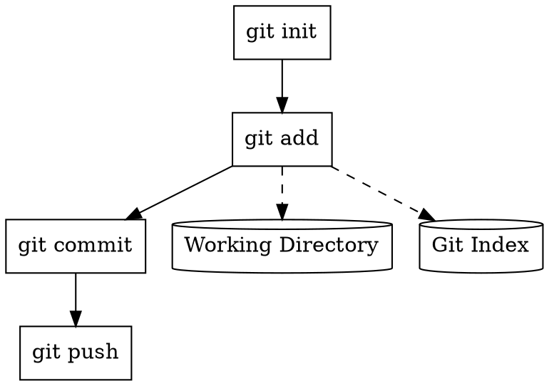

# Man Page to MCP Tools Pipeline

This document describes the complete pipeline for converting Unix man pages into working MCP tool graphs.

## Overview

The pipeline transforms traditional command-line documentation into:
1. Structured tool definitions
2. Dependency graphs
3. Executable MCP servers
4. Automated tests

## Pipeline Components

### Stage 1: Man Page Parsing

#### mcp-man-parse
```bash
mcp-man-parse git --format=structured > git_commands.json
```

Extracts:
- Command synopsis
- Option descriptions
- Arguments with types
- Examples
- Exit codes

Output structure:
```json
{
  "command": "git-add",
  "synopsis": "git add [--all] [--force] [--] <pathspec>...",
  "description": "Add file contents to the index",
  "options": [
    {
      "name": "--all",
      "short": "-A",
      "description": "Add changes from all tracked and untracked files",
      "type": "boolean"
    },
    {
      "name": "--force",
      "short": "-f",
      "description": "Allow adding otherwise ignored files",
      "type": "boolean"
    }
  ],
  "arguments": [
    {
      "name": "pathspec",
      "description": "Files to add content from",
      "type": "string",
      "multiple": true,
      "required": false
    }
  ],
  "examples": [
    {
      "command": "git add file.txt",
      "description": "Add a single file"
    }
  ]
}
```

### Stage 2: Tool Definition Generation

#### mcp-man2schema
```bash
mcp-man2schema git_commands.json > git_tools_schema.json
```

Converts parsed commands to MCP tool schemas:
```json
{
  "name": "git_add",
  "description": "Add file contents to the index",
  "inputSchema": {
    "type": "object",
    "properties": {
      "pathspec": {
        "type": "array",
        "items": {"type": "string"},
        "description": "Files to add content from"
      },
      "all": {
        "type": "boolean",
        "description": "Add changes from all tracked and untracked files"
      },
      "force": {
        "type": "boolean",
        "description": "Allow adding otherwise ignored files"
      }
    },
    "required": []
  }
}
```

### Stage 3: Dependency Analysis

#### mcp-dep-analyze
```bash
mcp-dep-analyze git_tools_schema.json > git_dependencies.json
```

Identifies:
- Command dependencies (e.g., add before commit)
- Shared resources (working directory, index)
- Execution order constraints
- Parallel execution opportunities

```json
{
  "dependencies": {
    "git_commit": {
      "requires": ["git_add"],
      "optional": ["git_status"]
    },
    "git_push": {
      "requires": ["git_commit"],
      "conflicts": ["git_pull"]
    }
  },
  "resources": {
    "working_directory": {
      "users": ["git_add", "git_status", "git_diff"],
      "exclusive": false
    },
    "git_index": {
      "users": ["git_add", "git_commit"],
      "exclusive": true
    }
  }
}
```

### Stage 4: Graph Construction

#### mcp-graph-gen
```bash
mcp-graph-gen --tools=git_tools_schema.json --deps=git_dependencies.json > git_graph.dot
```

Generates executable tool graphs:


### Stage 5: MCP Server Generation

#### mcp-graph2server
```bash
mcp-graph2server git_graph.dot --language=go > git_mcp_server.go
```

Generates complete MCP server:
```go
package main

import (
    "github.com/tmc/mcp"
    "os/exec"
)

type GitServer struct {
    *mcp.Server
    workDir string
}

func (s *GitServer) GitAdd(params GitAddParams) (*mcp.ToolResult, error) {
    args := []string{"add"}
    
    if params.All {
        args = append(args, "--all")
    }
    if params.Force {
        args = append(args, "--force")
    }
    args = append(args, params.Pathspec...)
    
    cmd := exec.Command("git", args...)
    cmd.Dir = s.workDir
    
    output, err := cmd.CombinedOutput()
    if err != nil {
        return nil, err
    }
    
    return &mcp.ToolResult{
        Content: []mcp.Content{
            {Type: "text", Text: string(output)},
        },
    }, nil
}

// Additional methods for other git commands...
```

### Stage 6: Test Generation

#### mcp-man2test
```bash
mcp-man2test git_commands.json --examples > git_tests.txt
```

Generates scripttest files from man page examples:
```
# Test: git add single file
exec git init
exec touch file.txt
exec git add file.txt
exec git status --porcelain
stdout 'A  file.txt'

# Test: git add all files
exec git init
exec touch file1.txt file2.txt
exec git add --all
exec git status --porcelain
stdout 'A  file1.txt'
stdout 'A  file2.txt'
```

## Advanced Features

### 1. Composite Commands

Handle complex command pipelines:
```bash
mcp-pipeline-parse "git add . && git commit -m 'Update' && git push"
```

Generates workflow:
```json
{
  "workflow": "git_add_commit_push",
  "steps": [
    {"tool": "git_add", "params": {"pathspec": ["."]}},
    {"tool": "git_commit", "params": {"message": "Update"}},
    {"tool": "git_push", "params": {}}
  ]
}
```

### 2. Interactive Commands

Convert interactive commands to MCP:
```bash
mcp-interactive-convert "git rebase -i HEAD~3"
```

Generates:
```json
{
  "tool": "git_rebase_interactive",
  "params": {
    "base": "HEAD~3",
    "operations": [
      {"type": "pick", "commit": "abc123"},
      {"type": "squash", "commit": "def456"},
      {"type": "reword", "commit": "ghi789"}
    ]
  }
}
```

### 3. Error Handling

Extract error patterns from man pages:
```bash
mcp-error-extract git > git_errors.json
```

```json
{
  "git_add": {
    "errors": [
      {
        "pattern": "fatal: pathspec .* did not match any files",
        "code": 128,
        "description": "No files matched the pathspec"
      }
    ]
  }
}
```

## Complete Example: FFmpeg

Transform FFmpeg man page to MCP:

```bash
# 1. Parse man page
mcp-man-parse ffmpeg > ffmpeg_commands.json

# 2. Generate schemas
mcp-man2schema ffmpeg_commands.json > ffmpeg_tools.json

# 3. Analyze dependencies
mcp-dep-analyze ffmpeg_tools.json > ffmpeg_deps.json

# 4. Build graph
mcp-graph-gen --tools=ffmpeg_tools.json --deps=ffmpeg_deps.json > ffmpeg_graph.dot

# 5. Generate server
mcp-graph2server ffmpeg_graph.dot --language=python > ffmpeg_server.py

# 6. Generate tests
mcp-man2test ffmpeg_commands.json > ffmpeg_tests.txt

# 7. Run server
python ffmpeg_server.py
```

Generated FFmpeg MCP server supports:
- Video conversion
- Audio extraction
- Format detection
- Streaming
- Filter graphs

## Best Practices

### 1. Incremental Development
Start with simple commands:
```bash
# Start with basic commands
mcp-man-parse ls > ls_tools.json
mcp-man2schema ls_tools.json > ls_mcp.json

# Test thoroughly
mcp-man2test ls_tools.json > ls_tests.txt
mcp-test-run ls_tests.txt

# Add complex commands gradually
mcp-man-parse find >> find_tools.json
```

### 2. Validation
Verify generated tools:
```bash
# Validate schemas
mcp-schema-validate git_tools.json

# Test with real commands
mcp-trace-record git add README.md > git_add_trace.jsonl
mcp-trace-validate git_add_trace.jsonl git_tools.json
```

### 3. Optimization
Optimize tool graphs:
```bash
# Remove redundant dependencies
mcp-graph-optimize git_graph.dot > git_graph_optimized.dot

# Identify parallelization opportunities
mcp-graph-analyze git_graph_optimized.dot --parallel
```

### 4. Documentation
Generate documentation:
```bash
# Generate markdown docs
mcp-graph2docs git_graph.dot > git_mcp_docs.md

# Create interactive visualization
mcp-graph-visualize git_graph.dot --format=html > git_graph.html
```

## Integration Examples

### CI/CD Pipeline
```yaml
name: Generate MCP Tools
on: [push]

jobs:
  generate:
    runs-on: ubuntu-latest
    steps:
      - uses: actions/checkout@v2
      
      - name: Parse man pages
        run: |
          mcp-man-parse git > git_tools.json
          mcp-man-parse curl > curl_tools.json
      
      - name: Generate servers
        run: |
          mcp-graph2server git_tools.json > servers/git_mcp.go
          mcp-graph2server curl_tools.json > servers/curl_mcp.go
      
      - name: Test
        run: |
          mcp-man2test git_tools.json > tests/git_test.txt
          mcp-test-run tests/git_test.txt
```

### Docker Compose
```yaml
version: '3'
services:
  git-mcp:
    build:
      context: .
      dockerfile: Dockerfile.git-mcp
    volumes:
      - ./workspace:/workspace
    command: mcp-server --tools=git_tools.json
    
  ffmpeg-mcp:
    build:
      context: .
      dockerfile: Dockerfile.ffmpeg-mcp
    command: mcp-server --tools=ffmpeg_tools.json
    
  orchestrator:
    build:
      context: .
      dockerfile: Dockerfile.orchestrator
    depends_on:
      - git-mcp
      - ffmpeg-mcp
    command: mcp-graph-execute workflow.dot
```

## Future Enhancements

1. **Machine Learning**
   - Learn command patterns from usage
   - Predict optimal workflows
   - Suggest tool combinations

2. **Natural Language**
   - Convert English to tool graphs
   - Generate explanations
   - Interactive assistants

3. **Performance**
   - Caching strategies
   - Parallel execution
   - Resource optimization

4. **Security**
   - Sandboxing
   - Permission models
   - Audit trails

This pipeline enables automatic conversion of traditional Unix tools into modern MCP services while preserving their functionality and documentation.