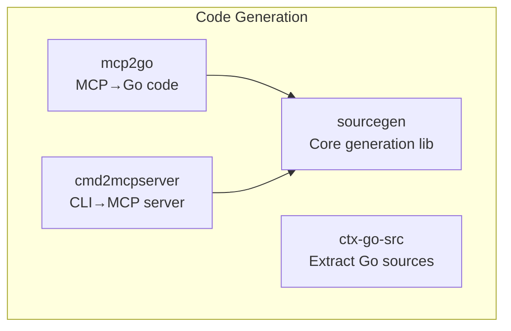
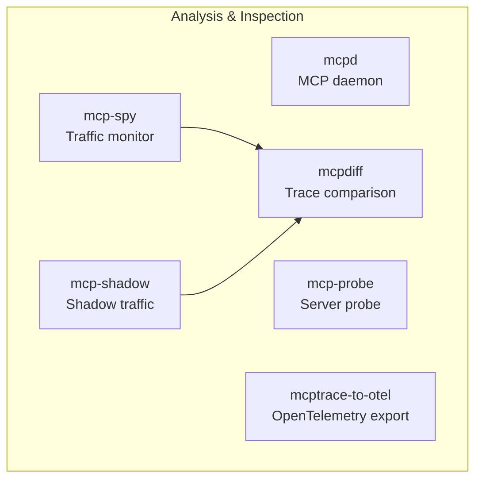
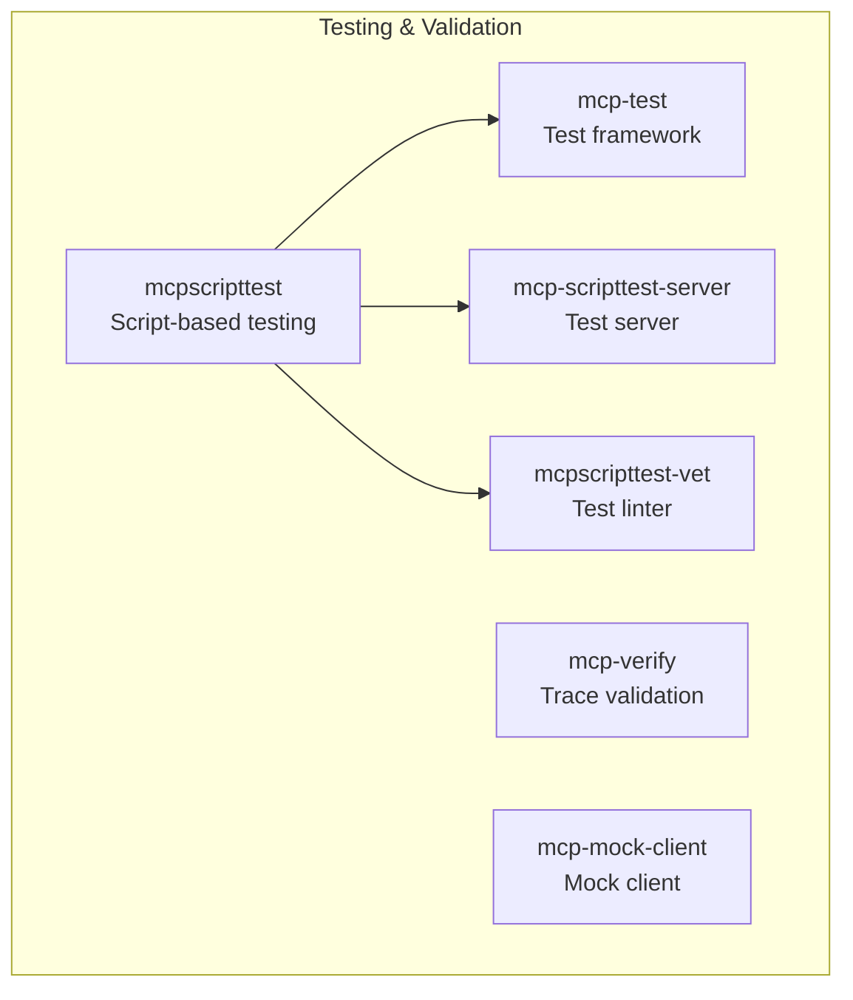
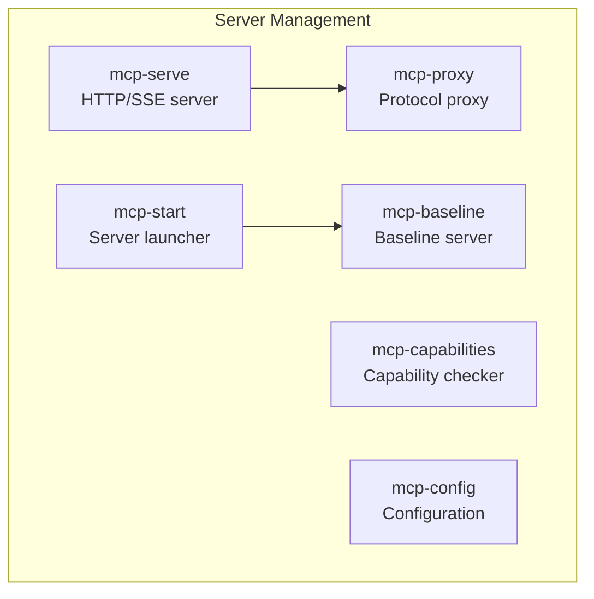
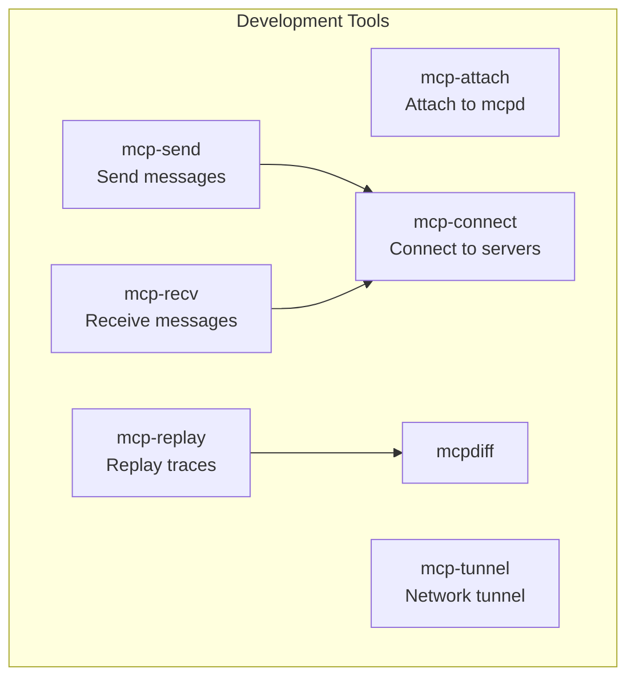
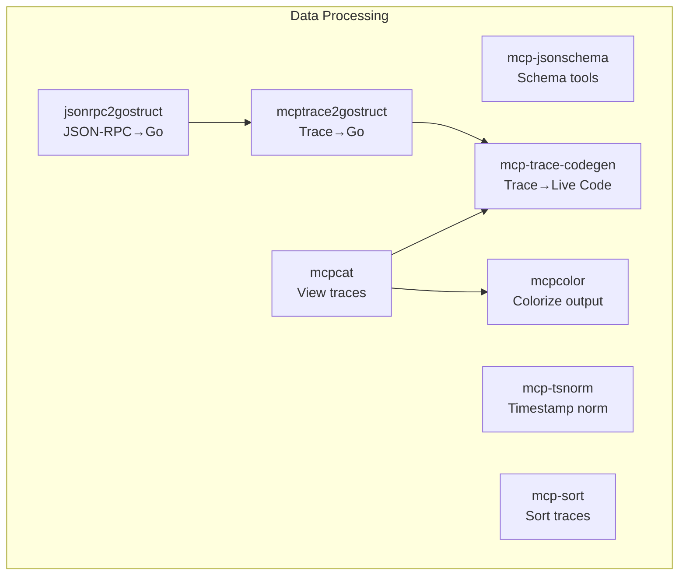
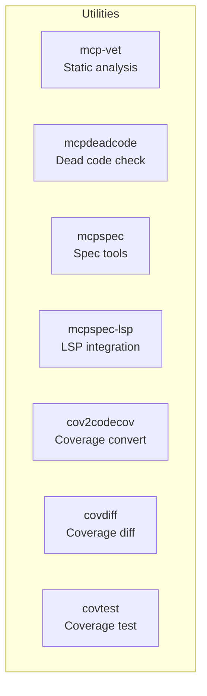
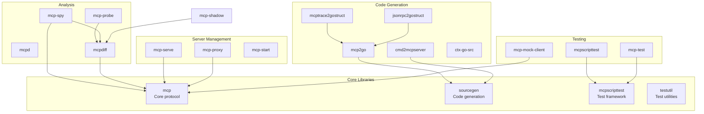

# MCP Tool Graph

This document describes the complete tool ecosystem in the MCP Go implementation, showing relationships and dependencies between tools.

## Tool Categories

### 🏗️ Code Generation Tools
Tools that generate code from various sources.



### 🔍 Analysis & Inspection Tools
Tools for analyzing and inspecting MCP implementations.



### 🧪 Testing & Validation Tools
Tools for testing and validating MCP implementations.



### 🚀 Server Management Tools
Tools for managing and running MCP servers.



### 🛠️ Development Tools
Tools for MCP development workflows.



### 📊 Data Processing Tools
Tools for processing and transforming MCP data.



### 🔧 Utility Tools
General utility tools for MCP development.



## Complete Tool Dependency Graph



## Tool Relationships

### Primary Workflows

1. **Code Generation Pipeline**
   ```
   MCP Description → mcp2go → Go Code
   CLI Tool → cmd2mcpserver → MCP Server
   Go Package → ctx-go-src → Source Archive
   ```

2. **Testing Pipeline**
   ```
   Test Scripts → mcpscripttest → Test Results
   MCP Server → mcp-mock-client → Validation
   Traces → mcp-verify → Conformance Check
   ```

3. **Analysis Pipeline**
   ```
   Live Traffic → mcpspy → Trace Files
   Trace Files → mcpdiff → Comparison
   Traces → mcptrace-to-otel → OpenTelemetry
   ```

4. **Server Management Pipeline**
   ```
   MCP Server → mcpd → Managed Server
   Server → mcp-serve → HTTP/SSE Endpoint
   Multiple Servers → mcp-proxy → Unified Access
   ```

## Future Tool Concepts

### 🔮 Planned Tools

1. **mcp-fuzz**: Fuzzing tool for MCP servers
   - Generate random valid MCP messages
   - Test server robustness
   - Integration with mcpscripttest

2. **mcp-bench**: Benchmarking tool
   - Performance testing
   - Latency measurements
   - Throughput analysis

3. **mcp-docs**: Documentation generator
   - Generate API docs from MCP descriptions
   - Interactive API explorer
   - Integration with mcpspec

4. **mcp-migrate**: Migration tool
   - Update tool definitions between versions
   - Schema migration assistance
   - Backward compatibility checking

5. **mcp-lint**: MCP definition linter
   - Validate tool definitions
   - Check naming conventions
   - Schema best practices

6. **mcp-netcap**: Network traffic capture for MCP
   - Capture MCP traffic at network level
   - Support for various protocols (TCP, Unix sockets, Named pipes)
   - Export to mcptrace format
   - Real-time filtering and analysis

7. **mcp-tcpdump**: TCP/HTTP traffic inspector for MCP
   - Live capture of MCP over HTTP/SSE
   - WebSocket traffic inspection
   - TLS decryption support
   - Integration with Wireshark dissectors

8. **mcp-pcap**: PCAP file analyzer for MCP
   - Extract MCP sessions from PCAP files
   - Reconstruct bidirectional flows
   - Generate mcptrace files from captures
   - Support for fragmented messages

9. **mcp-endpoint**: macOS Endpoint Security collector
   - Monitor process execution for MCP servers
   - Track file access patterns
   - Capture network connections
   - Security event correlation

10. **mcp-esmond**: Endpoint Security monitor daemon
    - Real-time ES event collection
    - MCP server behavior profiling
    - Anomaly detection
    - Compliance monitoring

11. **mcp-iterm**: iTerm2 automation tool
    - Analyze iTerm2 saved state and session data
    - Control iTerm2 via AppleScript/API
    - Create/manage terminal sessions programmatically
    - Extract command history and output
    - Integrate with MCP servers running in terminals
    - Support for split panes and window management

12. **mcp-terminal**: Cross-platform terminal automation
    - Abstract terminal operations across platforms
    - Support for Terminal.app, iTerm2, Windows Terminal
    - Session recording and playback
    - Command injection and output capture
    - PTY management and control

13. **mcp-docker**: Docker container management
    - List/inspect running containers
    - Execute commands in containers
    - Manage container lifecycle
    - Stream logs and events
    - Network and volume management
    - Compose file generation

14. **mcp-k8s**: Kubernetes integration
    - Pod and deployment management
    - Log streaming from containers
    - Resource inspection and modification
    - Event monitoring
    - Config and secret management
    - Helm chart interaction

15. **mcp-git**: Git integration for MCP
    - Analyze Go repository structure
    - Extract build tags and constraints
    - Module dependency tracking
    - Git hooks for MCP events
    - Commit message extraction
    - Branch workflow automation

16. **mcp-goast**: Go AST analysis
    - Parse Go source code
    - Extract function signatures
    - Generate interface definitions
    - Find type implementations
    - Analyze imports and dependencies
    - Generate documentation from code

17. **mcp-gofix**: Go code modification
    - Automated refactoring
    - Import path updates
    - API migration assistance
    - Struct tag manipulation
    - Interface extraction
    - Test generation

18. **mcp-gofmt**: Go formatting tools
    - Format Go code
    - Apply goimports
    - Custom formatting rules
    - Pre-commit hooks
    - Editor integration
    - Diff visualization

19. **mcp-metrics**: Performance metrics
    - expvar integration
    - Runtime metrics collection
    - Custom metric export
    - Prometheus exposition
    - StatsD integration
    - Metric aggregation

20. **mcp-log**: Log analysis
    - Structured log parsing
    - Log level filtering
    - Pattern matching
    - Time-based queries
    - Log correlation
    - Export formats

21. **mcp-pprof**: Go pprof integration
    - Extract CPU profiles from running MCP servers
    - Memory profile analysis
    - Goroutine and thread profiles
    - Block and mutex contention analysis
    - Automatic profile collection during tests
    - Profile diff comparison between versions
    - Integration with `go tool pprof`

22. **mcp-trace**: Go execution tracer
    - Capture runtime traces from MCP servers
    - Visualize goroutine interactions
    - Network and syscall event tracking
    - GC pause analysis
    - Latency breakdown visualization
    - Integration with `go tool trace`
    - Custom trace regions for MCP operations

33. **mcp-bench**: Go benchmark automation
    - Run benchmarks across MCP implementations
    - Track performance regressions
    - Memory allocation analysis
    - Comparative benchmarking
    - Benchmark result aggregation
    - Integration with `go test -bench`

34. **mcp-dlv**: Delve debugger integration
    - Attach to running MCP servers
    - Set breakpoints in tool handlers
    - Step through RPC processing
    - Inspect goroutine states
    - Core dump analysis
    - Remote debugging support

35. **mcp-unix**: Unix tool integration
    - Pipe MCP responses through Unix tools
    - awk/sed/grep integration
    - jq for JSON processing
    - xargs for parallel execution
    - find for filesystem operations
    - rsync for file synchronization

36. **mcp-systemd**: Systemd integration
    - Generate systemd service files
    - Journal log integration
    - Service dependency management
    - Resource limits and cgroups
    - Socket activation support
    - Watchdog integration

37. **mcp-dtrace**: DTrace/eBPF integration
    - System call tracing
    - Network packet inspection
    - File I/O monitoring
    - Custom probe points
    - Performance counter collection
    - Flame graph generation

38. **mcp-strace**: System call tracer
    - Trace syscalls made by MCP servers
    - File descriptor tracking
    - Network connection monitoring
    - Signal handling analysis
    - Performance bottleneck detection
    - Resource usage patterns

39. **mcp-lsof**: Open file tracking
    - Monitor file descriptors
    - Network connection listing
    - Unix socket tracking
    - Memory-mapped file detection
    - Process relationship mapping
    - Resource leak detection

40. **mcp-htop**: Process monitoring
    - Real-time CPU/memory usage
    - Goroutine count tracking
    - Network traffic monitoring
    - Disk I/O statistics
    - Container resource usage
    - Process tree visualization

41. **mcp-sar**: System activity reporter
    - Historical performance data
    - Resource utilization trends
    - Capacity planning metrics
    - Anomaly detection
    - Report generation
    - Integration with sysstat

42. **mcp-perf**: Linux perf integration
    - Hardware performance counters
    - CPU cache analysis
    - Branch prediction statistics
    - Kernel event tracking
    - Flame graph generation
    - Profile-guided optimization

43. **mcp-race**: Go race detector
    - Automatic race detection
    - Race condition reporting
    - Test coverage with race detector
    - Production race monitoring
    - Race-free certification
    - Integration with CI/CD

44. **mcp-cover**: Go coverage analysis
    - Code coverage reporting
    - Coverage diff between versions
    - Test coverage trends
    - Uncovered code detection
    - Coverage-guided fuzzing
    - HTML report generation

45. **mcp-vet**: Enhanced static analysis
    - Go vet integration
    - Custom linter rules
    - Security vulnerability scanning
    - Code smell detection
    - Dependency analysis
    - License compliance checking

46. **mcp-mod**: Go modules management
    - Dependency version tracking
    - Module proxy integration
    - Vendor management
    - Module graph visualization
    - Update notifications
    - Security advisory integration

47. **mcp-build**: Build automation
    - Multi-platform compilation
    - CGO configuration
    - Build flag management
    - Binary size optimization
    - Symbol stripping
    - Reproducible builds

48. **mcp-test**: Advanced testing
    - Parallel test execution
    - Test flakiness detection
    - Golden file testing
    - Property-based testing
    - Mutation testing
    - Test prioritization

49. **mcp-tailf**: Advanced log tailing
    - Multi-file tail with filters
    - JSON log parsing
    - Pattern highlighting
    - Rate limiting detection
    - Log rotation handling
    - Timestamp correlation

50. **mcp-watch**: File system watcher
    - inotify/fsevents integration
    - Recursive directory watching
    - Pattern-based filtering
    - Change type detection
    - Batch event processing
    - Debouncing support

51. **mcp-cron**: Cron job integration
    - Schedule MCP tool execution
    - Job dependency management
    - Failure notifications
    - Output capture and storage
    - Job history tracking
    - Concurrent execution limits

52. **mcp-tmux**: tmux automation
    - Create/manage tmux sessions
    - Pane layout automation
    - Command distribution
    - Session state persistence
    - Window synchronization
    - Buffer extraction

53. **mcp-ssh**: SSH tunnel management
    - Dynamic port forwarding
    - SSH key management
    - Jump host configuration
    - Connection multiplexing
    - Keep-alive management
    - ProxyCommand integration

54. **mcp-curl**: HTTP client tooling
    - Request templating
    - Response parsing
    - Cookie management
    - Rate limiting
    - Retry logic
    - Performance metrics

55. **mcp-openapi**: OpenAPI integration
    - Generate MCP tools from OpenAPI
    - API validation
    - Mock server generation
    - Client code generation
    - Documentation sync
    - Schema evolution tracking

56. **mcp-grpc**: gRPC tooling
    - Proto file parsing
    - Service reflection
    - Stream handling
    - Metadata manipulation
    - Health checking
    - Load balancing

57. **mcp-nats**: NATS messaging
    - Pub/sub operations
    - Request/reply patterns
    - Queue groups
    - Stream processing
    - JetStream integration
    - Cluster monitoring

58. **mcp-trace-codegen**: Real-time code generation from traces
    - Live trace analysis
    - Progressive code generation
    - Tool discovery from traces
    - Handler pattern detection
    - Example extraction
    - Streaming support

### 🚧 Experimental Ideas

1. **mcp-ai**: AI-powered tool generation
   - Generate tool implementations from descriptions
   - Suggest optimizations
   - Auto-complete tool definitions

2. **mcp-viz**: Visualization tool
   - Graphical representation of tool interactions
   - Real-time traffic visualization
   - Performance dashboards

3. **mcp-deploy**: Deployment tool
   - Container generation
   - Kubernetes manifests
   - Cloud deployment automation

## Tool Categories Summary

| Category | Purpose | Key Tools |
|----------|---------|-----------|
| Code Generation | Generate code from MCP definitions | mcp2go, cmd2mcpserver |
| Analysis | Inspect and analyze MCP traffic | mcpspy, mcpdiff |
| Testing | Test and validate MCP implementations | mcpscripttest, mcp-test |
| Server Management | Run and manage MCP servers | mcpd, mcp-serve |
| Development | Development workflow tools | mcp-send, mcp-connect |
| Data Processing | Transform MCP data | mcptrace2gostruct |
| Go Profiling | Performance analysis for Go servers | mcp-pprof, mcp-trace, mcp-bench |
| Go Development | Go-specific development tools | mcp-goast, mcp-gofix, mcp-gofmt |
| Unix Integration | Unix tool integration | mcp-unix, mcp-systemd, mcp-dtrace |
| System Monitoring | System-level monitoring | mcp-htop, mcp-sar, mcp-perf |
| Terminal | Terminal automation | mcp-iterm, mcp-terminal |
| Infrastructure | Container management | mcp-docker, mcp-k8s |
| Debugging | Debugging and analysis | mcp-dlv, mcp-strace, mcp-lsof |
| Build Tools | Build and module management | mcp-build, mcp-mod |
| Quality | Code quality and testing | mcp-vet, mcp-race, mcp-cover |
| Observability | Metrics and logging | mcp-metrics, mcp-log |

This tool graph represents the current state of the MCP Go implementation tooling ecosystem and provides a roadmap for future development.