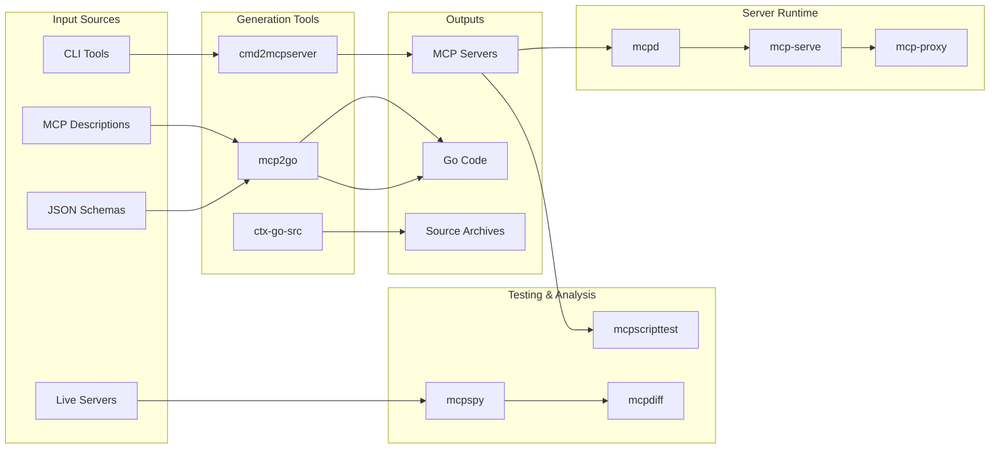

# MCP Tool Overview

A simplified view of the MCP tool ecosystem focusing on the most commonly used tools and their relationships.

## Primary Tool Flows



## Common Use Cases

### 1. Creating an MCP Server from a CLI Tool
```bash
# Generate MCP server from existing CLI
cmd2mcpserver -name mytool -description "My CLI tool" /path/to/cli

# Test the generated server
mcpscripttest -- ./mytool-server

# Run the server
mcpd -- ./mytool-server
```

### 2. Generating Go Code from MCP Tools
```bash
# Convert Claude Chat tools to Go
mcp2go ../mcptrace2gostruct/testdata/cc-tools.json

# Generate from single tool
mcp2go tool.json -package mypackage

# Generate from JSON schema
mcp2go schema.json -type User
```

### 3. Testing MCP Servers
```bash
# Run conformance tests
mcpscripttest -- ./my-server

# Monitor live traffic
mcpspy -- ./my-server

# Compare traces
mcpdiff trace1.mcp trace2.mcp
```

### 4. Managing MCP Servers
```bash
# Run with daemon
mcpd -- ./my-server

# Serve over HTTP/SSE
mcp-serve --sse -- ./my-server

# Proxy multiple servers
mcp-proxy --upstream server1:8080 --upstream server2:8081
```

## Tool Categories at a Glance

| Tool | Purpose | Example Usage |
|------|---------|---------------|
| **mcp2go** | Convert MCP tools to Go code | `mcp2go tools.json` |
| **cmd2mcpserver** | Create MCP server from CLI | `cmd2mcpserver mycommand` |
| **mcpscripttest** | Test MCP servers | `mcpscripttest -- ./server` |
| **mcpspy** | Monitor MCP traffic | `mcpspy -- ./server` |
| **mcpdiff** | Compare MCP traces | `mcpdiff old.mcp new.mcp` |
| **mcpd** | MCP server daemon | `mcpd -- ./server` |
| **mcp-serve** | HTTP/SSE server | `mcp-serve --sse -- ./server` |
| **ctx-go-src** | Extract Go sources | `ctx-go-src package/path` |

## Quick Start Paths

### For Tool Developers
1. Use `mcp2go` to generate Go types from tool descriptions
2. Implement tool logic in generated stubs
3. Test with `mcpscripttest`

### For Server Operators
1. Use `cmd2mcpserver` to wrap existing tools
2. Run with `mcpd` or `mcp-serve`
3. Monitor with `mcpspy`

### For Testing & QA
1. Write tests with `mcpscripttest`
2. Capture traces with `mcpspy`
3. Compare behaviors with `mcpdiff`

## Tool Selection Guide

Choose the right tool for your task:

- **Creating new tools?** → `mcp2go`
- **Wrapping existing CLIs?** → `cmd2mcpserver`
- **Testing servers?** → `mcpscripttest`
- **Debugging issues?** → `mcpspy` + `mcpdiff`
- **Running in production?** → `mcpd` or `mcp-serve`
- **Need source context?** → `ctx-go-src`

## Integration Points

Most tools work together:

```
CLI Tool → cmd2mcpserver → MCP Server → mcpscripttest → Validation
                                     ↓
                                   mcpspy → Traces → mcpdiff
                                     ↓
                                   mcpd → Production
```

This overview provides a starting point for understanding the MCP tool ecosystem. For detailed information about each tool, see the TOOL_GRAPH.md document.