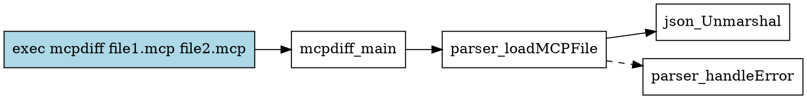

# TestCallGraph

TestCallGraph extends the Go standard `callgraph` tool to work with mcpscripttest tests, providing dynamic call graph analysis and proximity analysis for test coverage optimization.

## Features

- **Dynamic Call Graph Analysis**: Traces actual execution paths during test runs
- **Proximity Analysis**: Finds tests closest to uncovered code
- **Multi-Tool Support**: Works across different MCP tools (mcpdiff, mcpcat, etc.)
- **Multiple Output Formats**: DOT (Graphviz), JSON, and text
- **Coverage Integration**: Links call graphs to coverage data

## Installation

```bash
go install github.com/tmc/mcp/exp/mcpscripttest/testcallgraph/cmd/testcallgraph
```

## Usage

### Basic Call Graph Analysis

```bash
# Generate call graph for a test file
testcallgraph -packages ./cmd/mcpdiff,./cmd/mcpcat coverage_test.txt

# Output as Graphviz DOT format (default)
testcallgraph coverage_test.txt | dot -Tsvg > callgraph.svg

# Output as JSON
testcallgraph -format json coverage_test.txt > callgraph.json
```

### Proximity Analysis

Find which existing tests get closest to uncovered code:

```bash
# Find tests closest to parser.go line 89
testcallgraph -proximity parser.go:89 coverage_test.txt

# Output:
# Proximity Analysis for parser.go:89
# =================================
# 
# Closest test: coverage_test.txt:5
# Distance: 2 function calls
# 
# Suggested modification:
#   Change input from valid.mcp to invalid.mcp
#   Add malformed JSON to trigger error path
```

### Advanced Options

```bash
# Use different call graph algorithms
testcallgraph -algo cha coverage_test.txt  # Class Hierarchy Analysis
testcallgraph -algo vta coverage_test.txt  # Variable Type Analysis

# Include test code in analysis
testcallgraph -test coverage_test.txt

# Analyze specific packages
testcallgraph -packages github.com/tmc/mcp/cmd/mcpdiff coverage_test.txt
```

## How It Works

1. **Static Analysis**: Uses Go's SSA and callgraph packages to build static call graph
2. **Test Parsing**: Parses mcpscripttest files to extract test commands
3. **Dynamic Tracing**: Instruments binaries to collect runtime call information
4. **Proximity Calculation**: Uses graph algorithms to find shortest paths
5. **Visualization**: Generates various output formats for analysis

## Example Output

### DOT Format


### JSON Format
```json
{
  "test": "coverage_test.txt:5",
  "command": "exec mcpdiff file1.mcp file2.mcp",
  "calls": [
    {
      "from": "test",
      "to": "mcpdiff.main",
      "type": "dynamic"
    },
    {
      "from": "mcpdiff.main",
      "to": "parser.loadMCPFile",
      "type": "static",
      "location": {"file": "parser.go", "line": 45}
    }
  ],
  "proximity": {
    "target": "parser.go:89",
    "distance": 2,
    "path": ["mcpdiff.main", "parser.loadMCPFile", "parser.handleError"]
  }
}
```

## Implementation Status

- [x] Basic static call graph analysis
- [x] Proximity analysis algorithm
- [x] DOT output format
- [ ] Dynamic trace collection
- [ ] JSON output format
- [ ] Test file parsing
- [ ] Coverage integration
- [ ] Modification suggestions

## Future Enhancements

1. **Real Dynamic Tracing**: Implement actual runtime trace collection
2. **Coverage Integration**: Link with GOCOVERDIR data
3. **Smart Suggestions**: AI-powered test modification suggestions
4. **IDE Plugin**: Visual Studio Code extension
5. **CI Integration**: GitHub Actions for automatic analysis

## Contributing

1. Fork the repository
2. Create a feature branch
3. Implement your changes
4. Add tests
5. Submit a pull request

## License

Same as the main MCP project.