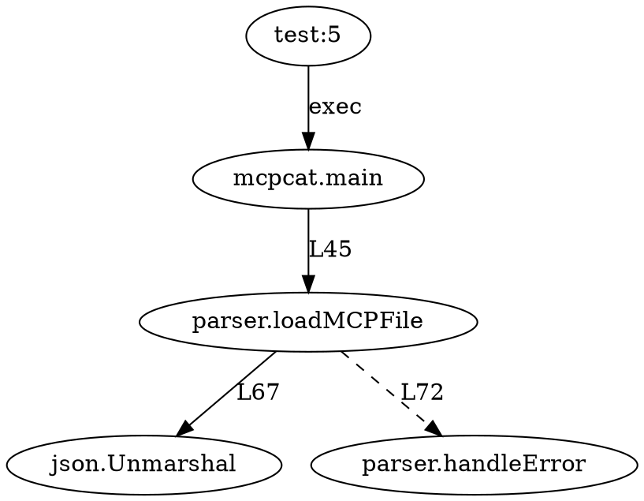

# TestCallGraph: Call Graph Analysis for MCPTestScript

## Overview

TestCallGraph extends the concept of `golang.org/x/tools/cmd/callgraph` to work with mcptestscript tests, providing dynamic call graph analysis for test execution.

## Key Differences from Standard Callgraph

1. **Dynamic vs Static**: Captures actual execution paths during test runs
2. **Test-Aware**: Understands scripttest format and test lines
3. **Coverage Integration**: Links call graphs to coverage data
4. **Multi-Binary**: Tracks calls across different MCP tools
5. **Proximity Analysis**: Calculates distances to uncovered code

## Architecture

```go
package testcallgraph

import (
    "golang.org/x/tools/go/callgraph"
    "golang.org/x/tools/go/ssa"
    "github.com/tmc/mcp/exp/mcpscripttest"
)

// TestCallGraph extends standard callgraph for test analysis
type TestCallGraph struct {
    // Static analysis from standard callgraph
    StaticGraph *callgraph.Graph
    
    // Dynamic execution traces
    DynamicTraces map[string]*ExecutionTrace
    
    // Test line to call mapping
    TestMapping map[TestLine][]CallSite
    
    // Coverage data integration
    Coverage *CoverageData
}

// ExecutionTrace captures runtime call information
type ExecutionTrace struct {
    TestFile   string
    TestLine   int
    Command    string
    CallStack  []CallFrame
    Coverage   float64
    Duration   time.Duration
}

// CallFrame represents a single function call
type CallFrame struct {
    Package  string
    Function string
    File     string
    Line     int
    Dynamic  bool // true if resolved at runtime
}
```

## Implementation Strategy

### 1. Instrument MCP Tools

```go
// BuildInstrumentedTool adds tracing to MCP tools
func BuildInstrumentedTool(toolPath string) error {
    // Parse tool source
    cfg := &packages.Config{Mode: packages.LoadAllSyntax}
    pkgs, err := packages.Load(cfg, toolPath)
    
    // Add tracing instrumentation
    for _, pkg := range pkgs {
        for _, file := range pkg.Syntax {
            addTraceInstrumentation(file)
        }
    }
    
    // Build with -cover and custom trace hooks
    cmd := exec.Command("go", "build", 
        "-cover",
        "-ldflags", "-X main.traceEnabled=true",
        "-o", outputPath,
        toolPath)
    
    return cmd.Run()
}

// addTraceInstrumentation modifies AST to add tracing
func addTraceInstrumentation(file *ast.File) {
    // Add import for trace package
    astutil.AddImport(fset, file, "github.com/tmc/mcp/exp/mcpscripttest/trace")
    
    // Instrument function entries/exits
    ast.Inspect(file, func(n ast.Node) bool {
        switch x := n.(type) {
        case *ast.FuncDecl:
            addFunctionTrace(x)
        }
        return true
    })
}
```

### 2. Runtime Trace Collection

```go
// TraceCollector gathers execution traces
type TraceCollector struct {
    traces chan *ExecutionTrace
    store  *TraceStore
}

// CollectTrace runs a test line and captures its call graph
func (tc *TraceCollector) CollectTrace(testLine TestLine) (*ExecutionTrace, error) {
    // Set up trace collection
    traceFile := createTraceFile()
    defer traceFile.Close()
    
    // Execute test with tracing enabled
    env := append(os.Environ(), 
        "TRACE_OUTPUT="+traceFile.Name(),
        "GOCOVERDIR="+coverageDir)
    
    cmd := createTestCommand(testLine)
    cmd.Env = env
    
    // Run and collect output
    output, err := cmd.CombinedOutput()
    
    // Parse trace data
    trace := parseTraceFile(traceFile)
    
    // Merge with coverage data
    coverage := collectCoverage(coverageDir)
    
    return &ExecutionTrace{
        TestFile:  testLine.File,
        TestLine:  testLine.Line,
        Command:   testLine.Command,
        CallStack: trace.Frames,
        Coverage:  coverage.Percentage,
    }, nil
}
```

### 3. Call Graph Construction

```go
// BuildTestCallGraph creates a call graph from test execution
func BuildTestCallGraph(testFile string) (*TestCallGraph, error) {
    // Parse test file
    lines := parseTestFile(testFile)
    
    // Build static call graph
    staticGraph := buildStaticGraph(getTestPackages(testFile))
    
    // Collect dynamic traces
    traces := make(map[string]*ExecutionTrace)
    collector := NewTraceCollector()
    
    for _, line := range lines {
        trace, err := collector.CollectTrace(line)
        if err != nil {
            log.Printf("Failed to trace line %d: %v", line.Line, err)
            continue
        }
        traces[line.Key()] = trace
    }
    
    // Merge static and dynamic data
    return &TestCallGraph{
        StaticGraph:   staticGraph,
        DynamicTraces: traces,
        TestMapping:   buildTestMapping(traces),
        Coverage:      mergeCoverageData(traces),
    }, nil
}
```

### 4. Analysis Features

```go
// ProximityAnalyzer finds tests closest to uncovered code
type ProximityAnalyzer struct {
    graph *TestCallGraph
}

// FindClosestTest finds the test that gets nearest to target
func (pa *ProximityAnalyzer) FindClosestTest(target SourceLocation) *ProximityResult {
    var closest *ProximityResult
    minDistance := int(^uint(0) >> 1) // MaxInt
    
    for testKey, trace := range pa.graph.DynamicTraces {
        distance := pa.calculateDistance(trace, target)
        if distance < minDistance {
            minDistance = distance
            closest = &ProximityResult{
                TestKey:  testKey,
                Distance: distance,
                Path:     pa.findPath(trace, target),
            }
        }
    }
    
    return closest
}

// calculateDistance computes call graph distance
func (pa *ProximityAnalyzer) calculateDistance(trace *ExecutionTrace, target SourceLocation) int {
    // Use BFS to find shortest path in call graph
    visited := make(map[string]bool)
    queue := []searchNode{{
        location: trace.LastLocation(),
        distance: 0,
    }}
    
    for len(queue) > 0 {
        node := queue[0]
        queue = queue[1:]
        
        if node.location.Equals(target) {
            return node.distance
        }
        
        // Explore static callees from this location
        for _, edge := range pa.graph.StaticGraph.Nodes[node.location.Function].Out {
            callee := edge.Callee
            if !visited[callee.String()] {
                visited[callee.String()] = true
                queue = append(queue, searchNode{
                    location: getLocation(callee),
                    distance: node.distance + 1,
                })
            }
        }
    }
    
    return -1 // Unreachable
}
```

### 5. Integration with MCPTestScript

```go
// TestCommand adds callgraph analysis to scripttest
type TestCommand struct {
    CallGraph *TestCallGraph
}

// Run executes a test with call graph tracking
func (tc *TestCommand) Run(s *script.State, args ...string) (script.WaitFunc, error) {
    // Parse test command
    testLine := parseTestLine(s, args)
    
    // Execute with tracing
    trace, err := tc.CallGraph.CollectTrace(testLine)
    if err != nil {
        return nil, err
    }
    
    // Store trace for analysis
    tc.CallGraph.AddTrace(testLine, trace)
    
    // Continue normal execution
    return execTestCommand(s, args)
}

// Register the enhanced command
func init() {
    mcpscripttest.RegisterCommand("exec", &TestCommand{})
}
```

## Usage Examples

```go
// Analyze test coverage paths
func main() {
    // Build call graph for test file
    graph, err := BuildTestCallGraph("testdata/coverage_test.txt")
    if err != nil {
        log.Fatal(err)
    }
    
    // Find tests closest to uncovered line
    target := SourceLocation{
        File: "parser.go",
        Line: 89,
    }
    
    result := NewProximityAnalyzer(graph).FindClosestTest(target)
    fmt.Printf("Closest test: %s (distance: %d)\n", 
        result.TestKey, result.Distance)
    
    // Suggest modification
    suggestion := SuggestModification(result)
    fmt.Printf("Suggestion: %s\n", suggestion)
    
    // Generate visualization
    viz := GenerateCallGraphViz(graph)
    viz.SaveAs("callgraph.svg")
}
```

## Output Formats

### 1. Text Format (like original callgraph)
```
testdata/coverage_test.txt:5    --dynamic--    mcpcat.main
mcpcat.main    --static:45:12--    parser.loadMCPFile
parser.loadMCPFile    --static:67:8--    json.Unmarshal
parser.loadMCPFile    --static:72:15--    parser.handleError
```

### 2. JSON Format
```json
{
  "test": "testdata/coverage_test.txt:5",
  "command": "exec mcpcat file.mcp",
  "calls": [
    {
      "from": "test",
      "to": "mcpcat.main",
      "type": "dynamic"
    },
    {
      "from": "mcpcat.main",
      "to": "parser.loadMCPFile",
      "type": "static",
      "location": {"file": "main.go", "line": 45}
    }
  ],
  "coverage": {
    "percentage": 23.4,
    "lines": 156
  }
}
```

### 3. Graphviz DOT Format


## Benefits

1. **Dynamic Analysis**: See actual execution paths, not just static possibilities
2. **Test-Centric**: Understand how tests exercise code
3. **Coverage Integration**: Link execution paths to coverage data
4. **Tool Support**: Works across multiple MCP tools
5. **Actionable Insights**: Get specific suggestions for improving coverage

This enhanced callgraph tool would provide unprecedented visibility into how scripttest tests actually execute code, enabling data-driven test optimization.